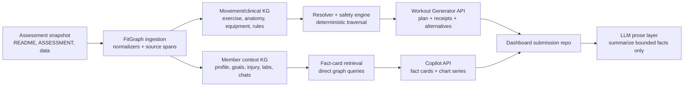

# Candidate Assessment + FitGraph Synthesis Plan

Date: 2026-06-04

## Purpose

This document plans how to synthesize three workstreams into one coherent
delivery path:

1. The upstream `future-research/candidate-assessment` repository, now vendored
   under `docs/external/candidate-assessment/`, which defines the take-home
   requirements and provides the synthetic data fixtures.
2. The local `/Users/kelly/Developer/fitgraph` repository, which is already
   building the deterministic knowledge graph module in the background.
3. The eventual coach-dashboard submission repository or app surface, which
   should consume FitGraph as the graph/reasoning package instead of
   reimplementing safety, provenance, resolver, and member-context logic.

The synthesis target is not just to satisfy the imported assessment. The target
is to contain it as a strict conformance baseline, then surpass it with a
production-shaped graph architecture, richer synthetic coverage, stronger
evaluation, and safer system boundaries.

## Current Inputs

### Imported Assessment Snapshot

Source snapshot:

- Source URL: `https://github.com/future-research/candidate-assessment/tree/main`
- Commit: `4b8c67246a659c26bd222079c5c7829d295acad9`
- Local path: `docs/external/candidate-assessment/`
- Snapshot metadata: `docs/external/candidate-assessment/SOURCE.md`

Imported files:

- `docs/external/candidate-assessment/README.md`
- `docs/external/candidate-assessment/ASSESSMENT.md`
- `docs/external/candidate-assessment/data/exercises.json`
- `docs/external/candidate-assessment/data/member-context.json`

The assessment requires a coach-facing dashboard with two surfaces:

- Workout Generator: prompt plus time window, graph-backed structured workout,
  safety filtering, equivalent alternatives, and provenance trace.
- Coach AI Copilot: member-context chat panel, quick prompts, charts, chat
  history/images, and grounded answers over synthetic member data.

The core constraint is that recommendations are knowledge-graph driven. The LLM
may parse coach language and write prose, but injury/equipment/exclusion safety
must be enforced deterministically by graph traversal.

### External Data Fixture Shape

`data/exercises.json` contains:

- 50 exercise records.
- 19 unique muscle groups:
  `biceps`, `calves`, `chest`, `core`, `deltoids`, `forearms`, `glutes`,
  `hamstrings`, `hip adductors`, `hip flexors`, `lats`, `lower back`,
  `middle back`, `obliques`, `quads`, `rotator cuff`, `traps`, `triceps`,
  `upper back`.
- 9 loaded joints/regions:
  `ankle`, `cervical spine`, `elbow`, `hip`, `knee`, `lumbar spine`,
  `shoulder`, `thoracic spine`, `wrist`.
- 36 movement patterns:
  `arms - accessory`, `balance`, `car`, `cardio`,
  `cardio - locomotion`, `cardio - plyometric`,
  `core - anti-extension`, `core - anti-lateral flexion`,
  `core - anti-rotation`, `core - carry`, `core - extension`,
  `core - flexion`, `core - rotation`, `isometric`, `legs - accessory`,
  `lower - abduction`, `lower - adduction`, `lower pull - hip lift`,
  `lower push - calf raise`, `lower push - lunge`,
  `lower push - split squat`, `lower push - squat`,
  `lower push - step-up`, `massage`, `mobility - dynamic`,
  `mobility - static`, `quadruped`, `regen`, `shoulders - accessory`,
  `total body`, `upper - adduction`, `upper pull - horizontal`,
  `upper pull - vertical`, `upper push - horizontal`,
  `upper push - vertical`, `yoga`.
- 32 equipment terms:
  `Adjustable Bench - Decline`, `Adjustable Bench - Incline`, `BOSU`,
  `Barbell`, `Box`, `Cable Resistance Machine`,
  `Chest Supported Row Machine`, `Dumbbell`, `EZ Bar`, `Flat Bench`,
  `Handle Attachment`, `Horizontal Leg Press Machine`, `Jump Rope`,
  `Kettlebell`, `Lacrosse Ball`, `Medicine Ball`, `Miniband`, `Plate`,
  `Preacher Curl Bench`, `Pull-Up Bar`, `Rack`,
  `Resistance Band - Loop`, `Resistance Band - With Handles`, `Sandbag`,
  `Seated Lat Pulldown Machine`, `SkiErg`, `Slant Board`,
  `Stability Ball`, `Stair Climber`, `Suspension Trainer`, `Wall`,
  `Yoga Mat`.

Each exercise includes source fields that should be preserved as provenance:

- `id`
- `name`
- `muscle_groups`
- `joints_loaded`
- `movement_patterns`
- `equipment_required`
- `is_bilateral`
- `side`
- `priority_tier`
- `is_reps`
- `is_duration`
- `supports_weight`
- `estimated_rep_duration`
- `bilateral_pair_id`

`data/member-context.json` contains one synthetic member, Jordan Rivera, with:

- profile and coach membership metadata;
- three goals: lower-body strength, pain-free squatting after left-knee
  flare-up, and 7+ hours of weeknight sleep;
- available home equipment: Dumbbell, Kettlebell, Yoga Mat,
  Resistance Band - Loop, Flat Bench;
- preferences: 50 minute sessions, 4 training days per week, preferred days,
  dislikes Deadlift and Burpees, preference for dumbbell/kettlebell at home,
  and dislike of high-impact jumping;
- a recovering left-knee injury since 2026-05-10, with note-level guidance:
  cleared for low-impact loading, avoid deep knee flexion under load and
  plyometrics;
- adherence declining from 100% to 50%;
- biomarkers including resting heart rate, HRV, sleep hours for the last 7 days,
  and weight trend;
- labs including blood panel and DEXA data;
- workout history, chat history, and coach brief;
- churn risk level `elevated`, with explicit reasons.

This fixture is the minimum conformance corpus. If FitGraph cannot ingest and
reason over every relevant part of it, the submission does not satisfy the
assessment. But the fixture is not the product limit.

### Current FitGraph State

Source-of-truth local docs:

- `docs/kg-module-prd.md`
- `GOAL.md`
- active brief: `docs/briefs/009-copilot-sleep-churn-coach-brief-fact-cards.md`
- `executor-reviewer-pair-programming.md`
- `docs/autonomous-workflow/`

FitGraph already encodes the same central thesis as the assessment:

- Deterministic graph traversal owns workout eligibility and safety.
- `MAPS_TO`/SKOS grounding is audit metadata, not runtime safety logic.
- Vector search may support free-text retrieval, but must not enforce safety.
- The LLM may parse or summarize but must not decide eligibility.
- Decision receipts must preserve reasons, graph paths, versions, and
  provenance.
- Member-context Copilot answers must be fact-card-first and source-backed.
- Ontology concept IDs, release IDs, license status, and access dates must not
  be claimed as verified unless pinned in `graph/ontology-lock.json`.

Current runtime coverage is intentionally small:

- `graph/exercise_kg.seed.json` has 5 `Exercise` nodes, 6 `BodyRegion` nodes,
  4 `Equipment` nodes, 4 `MuscleGroup` nodes, 3 `MovementPattern` nodes, and
  1 `ExerciseFamily` node.
- `graph/member_kg.seed.json` currently has one Jordan member node, one goal,
  one equipment availability record, one active left-knee injury, two adherence
  observations, one sleep biomarker observation, one churn signal, one coach
  brief, and two source spans.
- `kg.resolver` covers exact/local cases like `knee`, `left knee`,
  `kettlebell`, `no barbell`, `exclude deadlifts`, `pecs`, and an
  `only dumbbells and kettlebell` equipment subset prompt.
- `kg.safety` evaluates hard medical blocks, equipment hard blocks, prompt
  exclusions, all-reason collection, severity lattice selection, and
  receipt metadata.
- `kg.alternatives` selects alternatives only from already-selected safe
  receipts.
- `kg.member_retrieval` returns deterministic source-backed fact cards for
  available equipment, active injuries, goals, adherence trend, sleep this
  week, churn risk, and coach brief.
- `graph/ontology-lock.json` is explicitly unverified.

The FitGraph kernel is therefore the right reasoning foundation, but it is not
yet the full assessment product. The next work must expand coverage without
weakening the graph-first contract.

## Three-Repo Roles

### 1. Upstream Assessment Repo: Requirements And Fixtures

Treat `future-research/candidate-assessment` as a frozen external source.

Responsibilities:

- Define the product bar and deliverable expectations.
- Provide the golden synthetic fixture corpus.
- Provide exact scenario expectations: left knee, no barbell, exclude
  deadlifts, equivalent alternatives, brief/adherence/sleep/churn retrieval.
- Provide README deliverable requirements.

Do not:

- Edit the imported files to make tests pass.
- Treat the small fixture as the final production data model.
- Infer external ontology license or pinned concept status from the assessment
  text alone.

### 2. FitGraph Repo: Deterministic KG Package

Treat this repo as the graph authority.

Responsibilities:

- Ingest and normalize assessment data into typed graph snapshots.
- Enforce runtime safety through local graph traversal.
- Resolve coach/member text into typed constraints.
- Emit decision receipts and source spans.
- Serve deterministic member fact cards and chart series.
- Keep ontology grounding as a sidecar until verified.
- Provide package APIs or CLI contracts consumed by the dashboard app.

Do not:

- Put frontend-only decisions into the graph package.
- Let the dashboard or LLM duplicate safety rules.
- Move safety enforcement into vector retrieval.
- Claim ontology verification without `ontology-lock.json` evidence.

### 3. Dashboard Submission Repo: Product Surface And Agent Runtime

No existing local third repo was found during this pass. Until one is created
or identified, treat the third repo as the future full-stack product/submission
surface.

Responsibilities:

- Render the coach dashboard with mock auth, member view, workout generator,
  Copilot panel, quick prompts, charts, chat history/images, and provenance.
- Own the agentic workflow runtime that coordinates LLM calls and graph tools.
- Consume FitGraph through an explicit package boundary, local path dependency,
  git submodule, workspace package, or service API.
- Present FitGraph decision receipts and fact cards directly to the coach.
- Include a comprehensive staff-level README, architecture diagram, run
  command, examples, trade-offs, evaluation plan, and AI-use disclosure.

Do not:

- Reimplement graph safety logic in UI code.
- Hide unresolved safety-critical concepts behind confident prose.
- Treat LLM-generated text as source evidence.
- Use real member or personal data.

## System Boundary



Key boundary:

- The dashboard may ask the LLM to parse natural language into candidate
  constraints, but FitGraph must validate or reject the typed result before it
  affects safety.
- The dashboard may ask the LLM to write polished prose, but the prose must be
  constrained to FitGraph fact cards, receipts, and source spans.
- Vector retrieval may support chat history, coach notes, images, and broad
  open-ended summaries. It cannot be part of the hard safety path.

## Golden Spec Strategy

The imported `data/` folder should become a conformance suite, not just seed
data.

### Contain It

FitGraph should provide a repeatable importer that:

- Reads `docs/external/candidate-assessment/data/exercises.json`.
- Reads `docs/external/candidate-assessment/data/member-context.json`.
- Preserves the upstream source ID, source file, JSON path, source hash, and
  import snapshot commit on graph nodes or `SourceSpan` nodes.
- Produces normalized graph seeds or generated fixture graph snapshots.
- Validates exact fixture counts:
  - 50 exercises ingested.
  - 19 muscle groups represented.
  - 9 loaded joints/body regions represented.
  - 36 movement patterns represented.
  - 32 equipment terms represented.
  - Jordan profile, goals, equipment, preferences, injury, adherence,
    biomarkers, labs, workout history, chat history, coach brief, and churn
    risk represented.
- Fails CI if a required fixture field is silently dropped.

This turns the assessment data into a golden acceptance test.

### Surpass It

After the conformance importer is stable, FitGraph should support richer
synthetic expansion:

- Additional synthetic members with varied injuries, equipment, preferences,
  adherence patterns, and biomarkers.
- More exercise families and variant closure, including all deadlift, squat,
  lunge, jump, press, row, pull, carry, mobility, and core families.
- More nuanced `STRESSES` properties than the upstream fixture provides, such
  as loaded knee flexion, impact level, balance demand, axial load, laterality,
  and complexity.
- More member-context graph facts than the Copilot P0 quick prompts require,
  including barriers, coping strategies, action plans, adherence drivers,
  risk changes, and chartable longitudinal series.
- Evaluation corpora for resolver ambiguity, safety edge cases, alternative
  quality, fact-card grounding, and LLM-summary faithfulness.

Surpassing the fixture must never mean weakening the fixture. The imported data
remains the baseline contract.

## Ingestion Design

### Exercise Import Mapping

Recommended normalized node mapping:

| Source field | FitGraph representation |
|---|---|
| `id` | `Exercise` property `source_exercise_id`; also source-span key |
| `name` | `Exercise.label`; aliases include normalized name |
| `muscle_groups[]` | `MuscleGroup` nodes and `Exercise -TARGETS-> MuscleGroup` |
| `joints_loaded[]` | `BodyRegion` nodes and `Exercise -STRESSES-> BodyRegion` |
| `movement_patterns[]` | `MovementPattern` nodes and `Exercise -HAS_PATTERN-> MovementPattern` |
| `equipment_required[]` | `Equipment` nodes and `Exercise -REQUIRES-> Equipment` |
| `priority_tier` | `Exercise.properties.priority_tier` and normalized priority score |
| `is_bilateral`, `side`, `bilateral_pair_id` | laterality and paired-exercise properties |
| `is_reps`, `is_duration`, `supports_weight`, `estimated_rep_duration` | prescription capability properties |

The upstream `joints_loaded` array is not sufficient by itself to enforce
Jordan's restriction. The importer should initially create conservative
`STRESSES` edges from it, then a curation layer should enrich those edges with
the PRD stress properties:

```json
{
  "load_level": "low | medium | high",
  "impact_level": "low | medium | high",
  "flexion_depth": "none | limited | moderate | deep",
  "loaded": true,
  "axial_load": "none | low | medium | high",
  "balance_demand": "low | medium | high",
  "laterality": "left | right | bilateral | neutral"
}
```

Recommended stages:

1. Raw import: every upstream field is represented and source-backed.
2. Deterministic normalization: labels become stable local IDs.
3. Curation enrichment: stress semantics and exercise family memberships are
   added by local rules and reviewed fixtures.
4. Validation: no safety rule can depend on uncurated/default stress
   properties without a conservative fallback.

### Member Import Mapping

Recommended normalized node mapping:

| Source area | FitGraph representation |
|---|---|
| `profile` | `Member` node with source-backed properties |
| `goals[]` | `Goal` nodes and `Member -HAS_GOAL-> Goal` |
| `preferences` | `Preference` nodes or typed properties linked to member |
| `equipment_available[]` | `EquipmentAvailability` node or edges to `Equipment` |
| `injuries[]` | `InjuryEpisode`, `Restriction`, `Condition`, and body-region links |
| `workout_history[]` | `WorkoutSession` and `ExercisePerformance` nodes |
| `adherence` | `AdherenceObservation` series |
| `biomarkers` | `BiomarkerObservation` series, including sleep/HR/HRV/weight |
| `labs` | `LabResult` nodes and chartable panels |
| `chat_history[]` | `Message` nodes, source spans, and optional vector index records |
| `coach_brief` | `CoachBrief`, `ChurnSignal`, and task nodes |

Every claim-bearing node should have a `DERIVED_FROM` edge to a `SourceSpan`.
For arrays, prefer one `SourceSpan` per meaningful JSON path rather than one
global source for the entire member file. That gives Copilot answers line-item
evidence and makes fixture drift easier to debug.

### SourceSpan Contract

Every imported source span should include:

- `source_file`
- `json_path`
- `text` or canonical JSON excerpt
- `timestamp` when available
- `source_hash`
- `source_snapshot_commit`
- `synthetic_data: true`

This lets the dashboard show "why do we know this?" without relying on LLM
memory or unsourced narrative.

## Runtime Reasoning Design

### Resolver

FitGraph should preserve the existing resolver discipline:

1. Exact label or alias match.
2. Fuzzy lexical match with type hint and margin.
3. Embedding fallback only when exact/fuzzy fail.

For safety-critical slots, embedding fallback should not silently resolve unless
the margin and type are strong enough. Otherwise it should emit an
`UnresolvedConcept` with conservative behavior:

- `block_if_safety_critical`
- `ask_clarification`
- `ignore_if_non_safety`

Assessment-specific resolver acceptance examples:

- `knee` -> `BodyRegion:knee`, with anatomy closure.
- `left knee` -> `BodyRegion:left_knee`, laterality left, with `PART_OF` path.
- `bad lower back` -> lumbar/lower-back candidate or clarification path.
- `kettlebell` -> `Equipment:kettlebell`.
- `no barbell` -> negated hard equipment constraint.
- `only dumbbells and a kettlebell` -> hard allowed equipment subset.
- `exclude deadlifts` -> negated hard `ExerciseFamily:deadlift_family`.
- `pecs` -> `MuscleGroup:chest`.
- `squats` -> squat movement pattern and/or squat family.
- `press` -> ambiguous unless constrained by slot/context.

The assessment asks for an agentic runtime, but the runtime should use FitGraph
resolver outputs as typed data. It should not pass prompt text directly to the
safety engine.

### Safety

The safety path should remain:

```text
prompt/member context -> typed constraints -> graph traversal -> receipts
```

Hard blocks:

- active medical restriction;
- missing or disallowed equipment;
- explicit prompt exclusion;
- exercise-family exclusion;
- unresolved safety-critical ambiguity.

Soft penalties:

- member dislike;
- mild affected-region stress;
- non-preferred equipment;
- poor goal alignment;
- high complexity under elevated churn or adherence risk.

Jordan-specific required rules:

- Active left-knee issue affects `BodyRegion:left_knee`, which is part of
  `BodyRegion:knee`.
- Avoid deep knee flexion under load.
- Avoid plyometrics.
- Avoid high-impact jumping.
- Do not ban every knee-related movement. Low-impact loading can remain
  eligible when stress properties do not hit the active restriction.
- Available equipment is the hard subset:
  Dumbbell, Kettlebell, Yoga Mat, Resistance Band - Loop, Flat Bench.
- Deadlift and Burpees are member dislikes by default, not medical hard blocks
  unless the prompt makes them hard exclusions.

Receipt requirements:

- Include keep/drop/downrank/unresolved decisions.
- Preserve all reason codes, not just the primary reason.
- Select `primary_severity` by the PRD lattice.
- Include graph paths for the exercise, rule, injury/restriction, equipment,
  and source facts used.
- Include graph version, ruleset version, and ontology lock version.

### Alternatives

Alternatives must come from the already-safe pool. The current FitGraph
alternative selector follows that rule; scaling it to the full fixture should
add:

- exercise-family exclusions across all variants;
- target muscle overlap over the 19 imported muscle groups;
- movement-pattern similarity over the 36 imported patterns;
- equipment preference and hard availability filtering;
- priority tier scoring;
- source-backed explanation paths.

Example target scenario:

- If a barbell lunge or high-impact jump is filtered for Jordan, the alternative
  pool should prefer safe lower-body/glute/hamstring movements that fit home
  equipment and do not hit active knee restrictions.

### Copilot Fact Cards

FitGraph should produce fact cards before the LLM writes any response.

Required direct graph queries:

- `available_equipment`
- `active_injuries`
- `goals`
- `adherence_trend`
- `sleep_this_week`
- `churn_risk`
- `coach_brief`
- `last_four_weeks_comparison`
- `workout_completion`
- chart series for adherence, sleep, message pattern, weight/labs as useful

Every fact card should include:

- `claim`
- `confidence="deterministic"`
- `source_nodes`
- `query`

Absent data should return a "graph has no supporting fact" card rather than a
best guess.

For chat history and coach notes, vector retrieval can be used as supporting
retrieval, but the final answer should still cite graph fact cards or source
spans. Hybrid graph plus vector is appropriate for "why churn risk is elevated"
or "what changed recently"; it is not appropriate for workout safety.

## Dashboard Integration Contract

The dashboard repo should call FitGraph through narrow contracts.

### Workout Generator API

Suggested request:

```json
{
  "member_id": "Member:jordan",
  "prompt": "lower-body exercises that avoid aggravating a knee injury",
  "time_window_minutes": 50,
  "available_equipment": [
    "Dumbbell",
    "Kettlebell",
    "Yoga Mat",
    "Resistance Band - Loop",
    "Flat Bench"
  ],
  "date": "2026-06-04"
}
```

Suggested response:

```json
{
  "resolved_constraints": [],
  "workout": {
    "warmup": [],
    "main": [],
    "cooldown": []
  },
  "decision_receipts": [],
  "alternatives": [],
  "unresolved_concepts": [],
  "graph_version": "fitgraph-kg-m5-validation-v0",
  "ruleset_version": "ruleset-m2-safety-v0",
  "ontology_lock_version": "ontology-lock-m0-unverified"
}
```

The dashboard may format `workout` into sets, reps, duration, and rest, but it
should not add exercises absent from FitGraph's selected safe candidate set.

### Copilot API

Suggested request:

```json
{
  "member_id": "Member:jordan",
  "question": "Show me the brief",
  "date": "2026-06-04"
}
```

Suggested response:

```json
{
  "fact_cards": [],
  "chart_series": [],
  "retrieved_messages": [],
  "answer_constraints": {
    "summarize_only_fact_cards": true,
    "invent_member_data": false
  }
}
```

The LLM prompt for Copilot should be explicit: summarize only supplied facts;
when facts are absent, say the graph has no supporting fact.

## Ontology Strategy

The assessment names OPE, COPPER, SNOMED CT, PROV-O, and SKOS. FitGraph already
has the correct production posture:

- Use a small curated subset that affects behavior.
- Keep the local runtime taxonomy authoritative.
- Use SKOS-style `MAPS_TO` for labels, aliases, audit, and interoperability.
- Do not use `MAPS_TO` as a safety edge.
- Use PROV-O-shaped receipts and source spans.
- Use SHACL later for RDF graph validation, not runtime safety.
- Keep `ontology-lock.json` unverified until IDs, release IDs, access dates,
  and license status are truly pinned.

Near-term ontology work should focus on concepts that matter for the imported
fixture:

- OPE-like concepts for exercise, equipment, musculoskeletal region, movement
  pattern, and ailment.
- COPPER-like concepts for preferences, barriers, coping strategy, action plan,
  adherence, and personalization context.
- SNOMED-like local candidates for knee, left knee, knee joint, patella,
  patellar tendon, meniscus, lumbar spine/lower back, low back pain, and
  patellofemoral-pain-like conditions.

Do not claim exact SNOMED CT/OPE/COPPER IDs in README or UI until the lockfile
verifies them.

## Evaluation Plan

### Fixture Conformance

Automated checks:

- Imported external files match the recorded SHA-256 values.
- Exercise import produces expected counts: 50, 19, 9, 36, 32.
- Member import produces required node types and source spans for each top-level
  source area.
- Every claim-bearing member fact card has source nodes.
- No graph snapshot contains a `MAPS_TO` runtime safety edge.
- Ontology lock remains truthful.

### Resolver Evaluation

Test sets:

- Exact and alias: `knee`, `left knee`, `kettlebell`, `pecs`.
- Negation and subset: `no barbell`, `only dumbbells and a kettlebell`.
- Family exclusion: `exclude deadlifts`, later `no burpees`.
- Ambiguous: `press`, `squat`, `bad lower back`.
- Unknown safety-critical: must emit unresolved/clarification behavior.

Metrics:

- exact expected type;
- exact expected canonical ID;
- false-safe resolution count;
- unresolved-but-safe behavior count;
- latency budget per prompt.

### Safety Evaluation

Required scenarios:

- Left knee pain blocks deep loaded knee flexion by `PART_OF` closure.
- Left knee pain blocks plyometric/high-impact jumping.
- Left knee pain does not block every low-impact lower-body exercise.
- No barbell drops barbell-only exercises.
- Only dumbbells/kettlebell/yoga mat/etc. enforces hard equipment subset.
- Exclude deadlifts removes every deadlift variant.
- Dislikes downrank by default unless explicitly configured as hard blocks.
- Multiple reasons preserve secondary reasons and choose the highest severity.

Metrics:

- false unsafe selected count;
- false safe filtered count;
- receipt completeness;
- alternative validity from safe pool;
- deterministic repeatability across runs.

### Copilot Evaluation

Required questions:

- "Show me the brief."
- "How's adherence trending?"
- "Sleep this week."
- "What changed since last week?"
- "Check churn risk."
- "Plot adherence trend."
- "Compare last 4 weeks."

Metrics:

- answer grounded in supplied fact cards;
- unsupported claim count;
- source-node coverage;
- absent-data behavior;
- chart data shape correctness;
- LLM summary faithfulness if an LLM is used.

### Product Evaluation

Submission README should include:

- 2 to 3 example prompts and generated plans.
- At least one injury case.
- At least one limited-equipment case.
- Provenance/filtering traces.
- Architecture diagram.
- Trade-offs and failures.
- How AI was used.
- Production evaluation plan.

## Implementation Roadmap

### Phase 0: Source Snapshot And Planning

Status: done in this pass.

Deliverables:

- Imported assessment docs and data under
  `docs/external/candidate-assessment/`.
- Source metadata in `docs/external/candidate-assessment/SOURCE.md`.
- This synthesis plan.

### Phase 1: Fixture Conformance Importer

Goal:

- Convert imported `data/` into generated graph fixture snapshots without
  changing the read-only external snapshot.

Suggested files:

- `kg/assessment_import.py`
- `tests/test_assessment_import.py`
- generated fixture output under `graph/generated/` or `graph/fixtures/`
- source-span utilities shared with member retrieval

Acceptance:

- Import preserves all exercise and member fixture fields.
- Counts match the external assessment exactly.
- Source spans include JSON paths and hashes.
- Validation fails on silent drops.

### Phase 2: Full Movement/Clinical Graph Expansion

Goal:

- Expand the current 5-exercise proof graph to a normalized graph over all 50
  imported exercises plus curated runtime semantics.

Work:

- Create canonical IDs for all exercises, muscle groups, regions, equipment,
  movement patterns, and exercise families.
- Add family closure for deadlift, squat, lunge, jump, burpee, press, pull,
  row, carry, mobility, and core families as the data supports.
- Enrich `STRESSES` edges with curation rules and review markers.
- Add knee, lumbar, shoulder, wrist, ankle, hip, cervical, thoracic, elbow
  closure where needed.
- Expand safety rules for knee flexion, plyometrics, high impact, and lower
  back/lumbar prompts.

Acceptance:

- Assessment scenarios produce deterministic receipts.
- The graph can prove why an exercise was selected, filtered, downranked, or
  unresolved.
- Alternatives come only from selected safe receipts.

### Phase 3: Full Member Context Graph

Goal:

- Ingest all Jordan member fixture areas into the member KG.

Work:

- Add goals, preferences, full equipment availability, injury restrictions,
  workout history, adherence series, biomarkers, labs, chat history,
  coach brief, and churn signals.
- Use `SourceSpan` per claim-bearing JSON path.
- Model `Restriction` nodes for "avoid deep knee flexion under load",
  "avoid plyometrics", and "avoid high-impact jumping".
- Model member dislikes as soft constraints by default.

Acceptance:

- Copilot fact cards can answer all assessment quick prompts.
- Chart series are generated from graph facts.
- Absent data returns deterministic no-supporting-fact cards.

### Phase 4: API Boundary

Goal:

- Make FitGraph easy for the dashboard repo to consume.

Options:

- Python package with CLI and JSON stdout.
- Lightweight HTTP service around the package.
- Workspace/local path dependency if the dashboard is Python-backed.
- Generated JSON artifacts consumed by a TypeScript app, with Python used for
  build-time graph reasoning.

Recommendation:

- Start with a Python package plus CLI for speed and testability.
- Add HTTP only if the dashboard stack needs a live server boundary.

Minimum commands:

```bash
uv run python -m kg.validation
uv run python -m kg.assessment_import
uv run python -m kg.workout_generator --member Member:jordan --prompt "..." --minutes 50
uv run python -m kg.copilot --member Member:jordan --question "Show me the brief"
```

### Phase 5: Dashboard Submission Surface

Goal:

- Build the product UI required by the assessment while delegating graph
  truth to FitGraph.

Required views:

- Mock coach login/member selection.
- Member morning brief.
- Workout generator form.
- Structured workout render with warmup/main/cooldown.
- Provenance trace and filtered-out exercises.
- Alternative suggestions.
- Copilot chat with quick prompt palette.
- Charts for adherence, sleep, and message patterns.
- Source/evidence affordances for fact cards.

Critical UI behavior:

- Unresolved safety-critical prompts should show clarification state.
- Provenance should be visible enough to defend graph-driven recommendations.
- The UI should not hide filtered exercises; filtered/explained traces are part
  of the deliverable.

### Phase 6: Submission README And Evidence

Goal:

- Produce the staff-level deliverable.

README sections:

- High-level architecture diagram.
- Stack choices and rationale.
- How to run locally.
- How AI was used.
- Trade-offs and decisions.
- Evaluation plan.
- Example prompts and outputs with provenance.
- Known limitations and production path.

Example prompts:

1. "Lower-body workout for Jordan that avoids aggravating her left knee."
2. "She has no barbell, only dumbbells and a kettlebell."
3. "Exclude deadlifts and give me chest isolation around pecs."

## Key Product Decisions

### The Assessment Data Is Baseline, Not Ceiling

Use the fixture as a pass/fail corpus, then add richer synthetic data only after
the baseline import and tests are stable. This matches the user's directive to
contain the data folder but not be limited by it.

### FitGraph Owns Safety

The dashboard and agent runtime should never become a second source of safety
truth. They call FitGraph, render FitGraph outputs, and ask clarification when
FitGraph says a safety-critical term is unresolved.

### Local Taxonomy Owns Runtime Behavior

External ontologies ground and audit the model. They do not drive live
eligibility until verified and intentionally projected into local runtime
edges.

### Source Spans Are Product Features

Provenance is not only developer metadata. Coaches need to understand why an
exercise was chosen, why an alternative was suggested, and which member facts
support a Copilot answer.

### LLMs Are Presentation And Coordination Layers

LLMs can:

- parse coach language into candidate typed constraints;
- summarize fact cards;
- draft friendly coach-facing prose;
- help route broad Copilot questions.

LLMs cannot:

- decide whether an exercise is safe;
- invent member context;
- override hard medical/equipment constraints;
- produce unsupported source claims.

## Risks And Mitigations

| Risk | Mitigation |
|---|---|
| Fixture fields are imported but not semantically used | Add conformance tests and explicit gap labels: raw, normalized, curated, runtime-ready |
| `joints_loaded` is too coarse for safety | Require curated `STRESSES` properties before hard medical rules depend on them |
| Ontology grounding overclaims verified status | Keep lockfile unverified until IDs/license/release/access data are pinned |
| Dashboard duplicates safety logic | Define a strict FitGraph API boundary and test dashboard examples against FitGraph receipts |
| LLM summarizes beyond facts | Add fact-card-only prompts and faithfulness tests |
| Vector retrieval leaks into safety | Add validation that vector paths are not referenced in safety receipts |
| Alternatives are safe but poor quality | Evaluate target overlap, pattern similarity, equipment fit, and coach-readable reasons |
| Single synthetic member hides edge cases | Add synthetic expansion after fixture conformance |

## Open Questions

- What is the intended third repository path for the dashboard submission, if it
  already exists?
- Should the assessment snapshot remain in `docs/external/` long term, or move
  to `fixtures/external/` once import code exists?
- Should generated graph snapshots be checked in, or generated in CI from the
  imported fixture?
- Should FitGraph expose an HTTP service or stay as a package/CLI consumed by
  the dashboard repo?
- How much ontology verification is realistic before the submission deadline?
- Should member dislikes like Deadlift and Burpees remain soft by default in
  all examples, or should specific coach prompts promote them to hard
  exclusions?

## Immediate Next Slices

1. Add assessment fixture integrity checks.
2. Implement a read-only importer that converts imported data into normalized
   graph nodes, edges, and source spans.
3. Add tests for exact fixture counts and no dropped top-level member fields.
4. Expand equipment availability from the current two-item seed to the full
   Jordan fixture.
5. Add `Restriction` nodes from the knee injury note and connect them to safety
   rules.
6. Expand Copilot fact cards for sleep, churn risk, coach brief, and chart
   series.
7. Expand exercise graph coverage from 5 exercises to all 50 fixture exercises.
8. Add dashboard-facing CLI or API contracts.
9. Create or identify the third dashboard repo and wire it to FitGraph.
10. Produce example generated plans with receipts for the assessment README.

## Definition Of Done For Synthesis

The three workstreams are synthesized when:

- The external assessment snapshot is present, pinned, and hash-checked.
- FitGraph imports the golden `data/` fixture without silent drops.
- FitGraph can run the assessment scenarios over deterministic graph facts.
- The dashboard repo consumes FitGraph outputs rather than duplicating graph
  logic.
- Workout outputs include selected exercises, filtered exercises, alternatives,
  and provenance traces.
- Copilot outputs include source-backed fact cards and chart data.
- LLM output is bounded by graph facts and receipts.
- README evidence demonstrates injury-aware and limited-equipment cases.
- Ontology claims remain truthful against `graph/ontology-lock.json`.
