# CamiFit x FitGraph x Candidate-Assessment - Synthesis Plan

> **Status:** Canonical synthesis plan - opinionated architecture plus staged execution guardrails
> **Date:** 2026-06-04
> **Scope:** plan to fuse three repositories into one on-device product
> **Source repos:** CamiFit (/Users/kelly/Developer/camifit), FitGraph (/Users/kelly/Developer/fitgraph), candidate-assessment (vendored at docs/requirements/candidate-assessment, commit 4b8c672)
> **Decisions baked in:** CamiFit is the hero app; the FitGraph KG is ported to Swift for on-device use with a Python canonical oracle; monorepo topology; surpass via the on-device execution loop.

## Executive summary

CamiFit, FitGraph, and the candidate-assessment are not three projects — they are three roles in one system. The **candidate-assessment** (`docs/requirements/candidate-assessment/`) is the *requirements floor*: a graph-driven Workout Generator and Coach Copilot, two ontology-grounded knowledge graphs, a concept resolver, deterministic safety-by-traversal, and PROV-O provenance receipts, scored against 50 golden exercises and one synthetic member (Jordan Rivera: left-knee recovery, dumbbell/kettlebell only, declining adherence). **FitGraph** (`/Users/kelly/Developer/fitgraph/kg/`) is the *deterministic KG brain* that already operationalizes that floor in Python — closed-world graph traversals (PART_OF anatomy closure, VARIANT_OF family exclusion, equipment subset, STRESSES-rule matching), a six-level severity lattice, and signed Decision receipts. **CamiFit** (this repo) is the *product and execution layer*: an on-device macOS/iPhone app with a strictly-validated `ExerciseProgram` engine that runs and pose-grades real workouts, plus a coach-chat surface that already round-trips fenced `camifit-exercise`/`camifit-routine` JSON into actionable, validated cards.

The architecture is a **two-layer knowledge graph**. The Python `kg/` package stays as the *canonical build-time oracle*: it owns the ontology pipeline and compiles a frozen, signed graph artifact plus a set of conformance vectors. It never ships at runtime. The **Swift serving runtime** ports the deterministic traversals on-device, loads the signed artifact offline, and — as a hard CI gate — must reproduce the Python oracle's conformance vectors byte-for-byte (same sorted iteration, same `round(…,6)`, same `sha256[:16]` fingerprints, same `graph_paths` evidence strings). Determinism is the contract that lets the brain move from server to phone without behavioral drift.

The implementation stance is deliberately staged: the Swift serving runtime is
the target architecture, not the first blind coding slice. First freeze the
golden candidate-assessment snapshot, import the full 50-exercise/Jordan corpus
into the Python oracle, define the JSON contracts, and emit conformance vectors.
Only then port graph traversal to Swift, with parity as the acceptance gate.
CamiFit may use fixture responses while the runtime is being built, but that is
a UI/modeling tactic, not the architecture.

The moat is the **closed execution loop** that the assessment never asks for and cannot test. The assessment stops at *rendering* a plan. CamiFit closes the loop: the Swift KG runtime resolves the coach's prompt, filters the catalog by traversal, emits receipts, then **compiles the surviving candidates into a real `ExerciseProgram`**, runs them through the on-device pose engine, and grades them — reps, holds, ROM, form-rule cues, a per-set score. Those performance observations flow back into the Member KG as new fact nodes, which re-ground the copilot, sharpen churn signals, and condition the next generation. The assessment writes the workout; CamiFit runs it, scores it, and learns from it — turning a one-shot recommendation demo into a continuously-improving, fully-offline coaching system.

## System at a glance

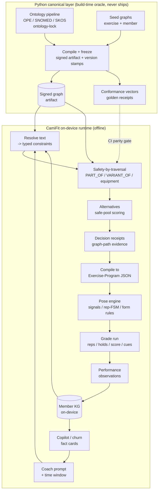

## How to read this document

Each section answers one question:

1. **Synthesis thesis and system topology** — What is the single system, and how do the three repos map to product, brain, and requirements floor?
2. **Repo teardown — what each piece is today** — What actually exists right now in CamiFit, FitGraph, and the assessment data, before any integration?
3. **Assessment conformance map** — How does every testable assessment requirement (WG/CP/KG/RES/SAF/PROV/TST/DEL) map onto existing or planned components, and where are the gaps?
4. **The two-layer knowledge graph** — How does the Python canonical oracle compile a signed artifact that the Swift serving runtime runs on-device with conformance parity?
5. **The three integration contracts** — What are the exact boundaries: the graph artifact + conformance vectors, the resolve/safety/receipt API, and the KG-candidate -> `ExerciseProgram` compile contract?
6. **The closed execution loop — the surpass** — How does a generated plan get run, pose-graded, and written back as member facts, and why is this the moat the assessment cannot test?
7. **Coach copilot inside the CamiFit chat** — How does the existing fenced-block chat surface become a KG-grounded copilot with deterministic fact cards instead of a generic LLM?
8. **Monorepo migration and dual autonomous loops** — How do the Swift app, Python canonical kg, and shared contracts coexist in one repo, and what are the two autonomous loops (compile loop, execution loop)?
9. **Ontology provenance and on-device determinism** — How do PROV-O receipts, version stamping, and the unverified ontology lock survive the port to an offline, deterministic Swift runtime?
10. **Contain versus surpass ledger** — Which work merely satisfies the assessment floor, and which work deliberately exceeds it, with the trade-off accounting?
11. **Risks, open questions, and phased roadmap** — What are the known gaps (resolver fuzzy/embedding, single-tier data, laterality, SNOMED pinning), and in what phased order do we close them?

## Table of contents

- [1. Synthesis thesis and system topology](#1-synthesis-thesis-and-system-topology)
- [2. Repo teardown - what each piece is today](#2-repo-teardown---what-each-piece-is-today)
- [3. Assessment conformance map](#3-assessment-conformance-map)
- [4. The two-layer knowledge graph](#4-the-two-layer-knowledge-graph)
- [5. The three integration contracts](#5-the-three-integration-contracts)
- [6. The closed execution loop - the surpass](#6-the-closed-execution-loop---the-surpass)
- [7. Coach copilot inside the CamiFit chat](#7-coach-copilot-inside-the-camifit-chat)
- [8. Monorepo migration and dual autonomous loops](#8-monorepo-migration-and-dual-autonomous-loops)
- [9. Ontology provenance and on-device determinism](#9-ontology-provenance-and-on-device-determinism)
- [10. Contain versus surpass ledger](#10-contain-versus-surpass-ledger)
- [11. Risks open questions and phased roadmap](#11-risks-open-questions-and-phased-roadmap)

## 1. Synthesis thesis and system topology

**Thesis.** We fuse three repos into one on-device product by making CamiFit the hero app, porting FitGraph's deterministic knowledge-graph brain into Swift so safety reasoning runs offline against a frozen build-time artifact, and treating the candidate-assessment as a requirements floor we contain and surpass — the durable moat being a *closed on-device execution loop* that no plan-rendering dashboard can match: the same graph that decides what is safe also runs the workout, pose-grades every rep, and writes the result back into the member graph.

### 1.1 The three roles, defined precisely

| Repo | Role in the fused product | What it concretely contributes (real artifacts) | What it is NOT allowed to become |
|---|---|---|---|
| **CamiFit** (`/Users/kelly/Developer/camifit`) | **Hero product + on-device execution.** Member-facing macOS/iPhone app that *runs and grades* workouts. | The deterministic exercise engine (`Sources/CamiFitEngine/ExerciseProgram.swift`, `ProgramLoader.swift`, the `Expression/{Lexer,Parser,Evaluator}.swift` sandboxed DSL, `RepStateMachine.swift`, `HoldEvaluator.swift`, `FormRuleEvaluator.swift`); the SwiftUI shell + coach chat (`Sources/CamiFitApp/ContentView.swift`, `CodexAppServerClient.swift`); the fenced-block authoring grammar + validation gate (`Regimen/RegimenBlockParser.swift`, `RegimenCard.swift`, `WorkoutRoutine.swift`, `RegimenStore.swift`). | A thin client to a server. Nothing in the safety path may require the network. |
| **FitGraph** (`/Users/kelly/Developer/fitgraph`) | **Deterministic KG brain — ported to Swift.** The closed-world typed property graph + traversals + safety lattice that decide *eligibility*. | The Python canonical layer (`kg/graph_store.py` PART_OF closure + `part_of_path` BFS, `kg/safety.py` severity lattice + 3 reason generators + `DecisionReceipt`, `kg/resolver.py` exact/alias resolver, `kg/alternatives.py` safe-pool scoring, `kg/provenance.py` `stable_fingerprint`) and the six seed JSONs under `graph/`. | A runtime dependency. The Python `kg/` **never ships**; it is the build-time oracle + ontology pipeline. The Swift port is what runs on device. |
| **Candidate-assessment** (`/Users/kelly/Developer/camifit/docs/requirements/candidate-assessment/`) | **Requirements floor — contained and surpassed.** The take-home spec + golden data that defines the minimum bar. | `ASSESSMENT.md` (WG/CP/KG/RES/SAF/PROV checklist), `data/exercises.json` (50 exercises; 19 muscle_groups / 9 joints / 36 movement_patterns / 32 equipment), `data/member-context.json` (Jordan Rivera). | The product. It renders a plan and stops; we keep every behavior it tests and add the execution loop it never asks for. |

**Why CamiFit is the hero.** The assessment's deliverable is a *coach dashboard* — a browser surface that emits a plan and a provenance trace (ASSESSMENT.md WG-2, WG-4, DEL-9). CamiFit already owns the one capability the assessment never contemplates: a timestamped, calibrated, fully-offline engine that ingests MediaPipe landmarks and drives a rep FSM / hold accumulator / form-rule pipeline into live cues and a per-set score (`Sources/CamiFitEngine/EngineTraceRecorder.swift:73-111`). The assessment dashboard's natural home in CamiFit already exists — its coach chat (`ContentView.swift`'s `ChatViewModel` + `CodexAppServerClient.swift`) round-trips structured artifacts: free text in, a validated `ExerciseProgram`/`WorkoutRoutine` out, rendered as cards that mutate real session state. So the assessment's "coach dashboard" collapses cleanly into CamiFit's in-app coach-chat + copilot, and the KG brain plugs in behind it. Making the dashboard the hero would invert this — we'd be wrapping the executing engine inside a planning tool. The execution engine is the rarer, harder asset; it leads.

### 1.2 Layered system topology

Five layers, two of which are device-resident and one of which (Python canonical) runs **only at build time**:

| Layer | Lives | Status | Backing artifacts |
|---|---|---|---|
| **L0 — Devices** | macOS / iPhone | CURRENT shell, no iPhone target yet | `CamiFitApp.swift` `@main`; `LiveCameraView.swift` live/synthetic pose paths |
| **L1 — Chat / Copilot** | On device | CURRENT (generic brain) | `ContentView.swift` `ChatViewModel`; `CodexAppServerClient.swift` (JSON-RPC, `sandbox:"read-only"`, `approvalPolicy:"never"`); `RegimenBlockParser.swift` |
| **L2 — KG serving runtime (Swift)** | On device | **PROPOSED** (port of `kg/`) | Ports `graph_store.py` traversals, `safety.py` lattice + `DecisionReceipt`, `resolver.py`, `alternatives.py`, `provenance.py`, `member_retrieval.py` |
| **L3 — Exercise engine** | On device | CURRENT | `CamiFitEngine/*` — the full pose→signal→filter→validity→rep/hold→form-rule→cue/summary pipeline |
| **L4 — Python canonical layer** | **Build / CI only** | CANONICAL (stays Python) | `kg/*.py` oracle + `graph/*.seed.json` + ontology pipeline → compiles a **frozen, signed graph artifact** + **conformance vectors** |

The contract between L4 and L2 is the spine of the whole design (detailed in §5, "The three integration contracts"; the two-layer KG model in §4). L4's Python canonical compiles a frozen artifact stamped with `graph_version` / `ruleset_version` / `ontology_lock_version` (the freeze coordinates from `graph/provenance_schema.json`) plus conformance vectors derived from the Python oracle's golden outputs (`tests/test_safety.py`, `tests/test_resolver.py`, `tests/test_alternatives.py`). L2 loads that artifact and **must reproduce the oracle's receipts byte-for-equivalent in CI** — same `decision`, same ordered `reason_codes`, same `graph_paths` strings (`"{source} -{predicate}-> {target}"`), same `constraint_fingerprint` (`sha256[:16]` over sorted-key JSON, `kg/provenance.py`). That conformance gate is what lets us port the brain to Swift without forking its behavior.

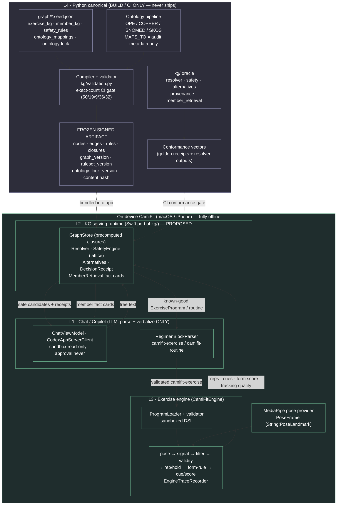

### 1.3 Why the closed execution loop is the moat

The assessment terminates at **render**: a structured plan plus a provenance trace (ASSESSMENT.md WG-2/WG-4, DEL-8). It has no concept of a workout being *performed*; nothing in the spec or golden data closes the loop. CamiFit closes it, and that closure is the defensible difference:

1. **Decide (L2).** Resolve Jordan's constraints — `left knee` → `BodyRegion:left_knee` with PART_OF closure, `only dumbbells and a kettlebell` → an allowed-equipment subset gate, `exclude deadlifts` → an `ExerciseFamily` exclusion — and emit one `DecisionReceipt` per candidate via deterministic traversal (`kg/safety.py` lattice: `MEDICAL_HARD_BLOCK > EQUIPMENT_HARD_BLOCK > PROMPT_EXCLUSION > … > BOOST`). **The graph decides; the LLM never decides eligibility** (invariant from `safety_rules.seed.json` `runtime_policy`).
2. **Author (L1→L3).** The safe, selected exercises compile into the exact artifact L3 consumes — an `ExerciseProgram` (the contract root, `ExerciseProgram.swift:27-87`) emitted as a `camifit-exercise` fenced block and forced through the existing dry-run gate (`RegimenBlockParser.validateExercise`, confirmed at lines 46-60: `ProgramLoader.load` then `FrameSignalProcessor` over a real sample frame). A KG-grounded generator targets this same grammar with **zero UI changes**.
3. **Run + grade (L3).** The engine executes the workout against live pose, counting reps with ROM/dwell/cooldown gating and firing weighted form cues (`RepStateMachine.swift`, `FormRuleEvaluator.swift`).
4. **Write back (L3→L2).** Real session telemetry — reps completed, cue history, per-set form score, tracking quality — already exists on `AppExerciseSessionViewModel.state` / `AppHUDState.swift` and **PROPOSED**: feeds back as new member-graph facts (analogous to `AdherenceObservation` / `BiomarkerObservation` nodes in `member_kg.seed.json`), so the next decision is grounded in what the member *actually did*, not free text.

A dashboard can produce step 1 and stop. It cannot close steps 2–4 because it has no executing engine and no pose-grading loop — those are CamiFit's, and they run **offline, deterministically, on the member's device**. The same determinism guarantees that make the safety verdict auditable (sorted traversals, `round(...,6)` scores, sorted-key fingerprints in `kg/provenance.py`) also make the *graded outcome* auditable: a signed graph artifact decided it was safe, a sandboxed total DSL (`Expression/Evaluator.swift` — no I/O, no loops, no side effects) graded it, and a provenance receipt ties both back to a frozen `graph_version`. That end-to-end determinism, on device, with no network in the safety path, is the moat. The rest of this document specifies how each layer is built and conformed: the two-layer KG (§4), the three integration contracts (§5), the closed loop in detail (§6), and the copilot inside the chat (§7).

---

## 2. Repo teardown - what each piece is today

This section is a file-grounded inventory of all three repos **as they exist today**, before any fusion work. The thesis from §1 — CamiFit is the hero, FitGraph's deterministic KG ports into Swift, the assessment is the floor — only holds if we are honest about what is actually built versus what is PRD prose. The recurring theme: **CamiFit ships a mature, fully-wired on-device execution loop; FitGraph ships a small but rigorously-tested deterministic KG runtime over a ~10x-undersized seed graph; the assessment is a fixed spec plus golden data that both must conform to.**

### System-level map (current reality)

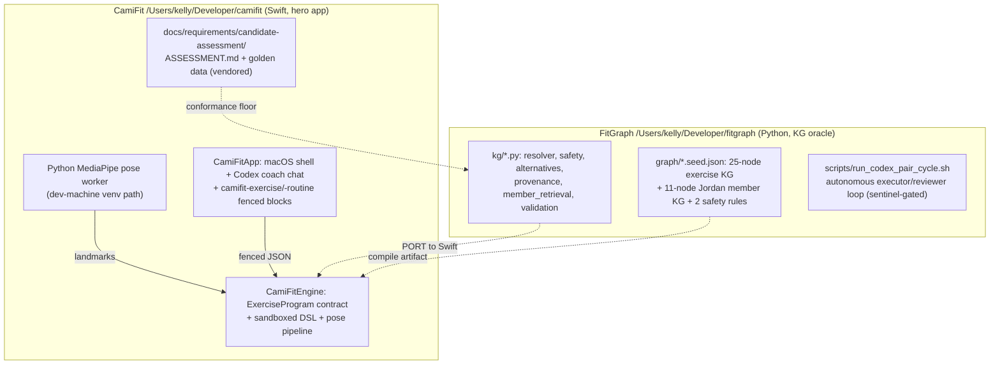

### (a) CamiFit — the hero app

| Component | File(s) | What it does | Maturity |
|---|---|---|---|
| Exercise-Program contract | `Sources/CamiFitEngine/ExerciseProgram.swift` | 13-field `Codable` root (setup, signals, filters, validity, rep⊕hold, form_rules, set) with snake_case `CodingKeys`. The JSON a generator must emit. | **Production-grade.** Strict, frozen, exercised by 4 presets. |
| Load + validate | `Sources/CamiFitEngine/ProgramLoader.swift` | `ProgramValidator` enforces every structural invariant; `ExpressionReferenceScanner` is a regex allowlist (10 funcs, 15 landmarks, state vars). Rejects bad programs **at load**. | **Mature**, with one honest gap: `form_rules.when` is NOT validated here (see §11 risks). |
| Runtime DSL | `Expression/{Lexer,Parser,AST,Evaluator}.swift` | Total, sandboxed expr engine. Arithmetic + single-comparison predicates; implements only `abs/angle/angle_to_vertical`. No booleans, no strings, no lists at runtime. | **Mature but narrower than the loader allowlist** — this divergence is integration contract #1 (§5). |
| Pose pipeline | `SignalEvaluator.swift`, `FilterPipeline.swift`, `RepStateMachine.swift`, `HoldEvaluator.swift`, `FormRuleEvaluator.swift`, `SetProgressTracker.swift`, `EngineTraceRecorder.swift` | pose→signal→filter→validity→rep/hold→form-rule→cue/score, timestamp-driven, fully offline. | **Production-grade**, golden-trace tested via `EngineTraceFormatter`. |
| Presets | `Presets/{squat,pushup,lunge,plank}.json` (+ mirror in `Sources/CamiFitApp/Resources/Presets/`) | 4 v1 exercises (3 rep, 1 hold). Byte-identical mirrors. | **Stable**, tiny library. |
| macOS shell | `Sources/CamiFitApp/{CamiFitApp,ContentView}.swift` | `NavigationSplitView`: session sidebar, 16:9 pose hero stage, inspector chat, live StatTiles/CueBanner, routine progress strip. | **Mature** but `ContentView.swift` is a ~980-line monolith (refactor seam, §11). |
| Coach transport | `Sources/CamiFitApp/CodexAppServerClient.swift` | `codex app-server` over newline-delimited JSON-RPC 2.0; ChatGPT login over the live connection; `approvalPolicy:"never"`, `sandbox:"read-only"`, every server→client request answered `-32601`. Coach emits **text only** — no shell, file, or network side effects. | **Mature**, hardened against the documented 401. Honors the fitgraph invariant "LLM verbalizes but never decides" by construction. |
| Regimen authoring | `Sources/CamiFitApp/Regimen/{RegimenBlockParser,RegimenCard,WorkoutRoutine,RegimenStore}.swift` | Parses ```` ```camifit-exercise ````/```` ```camifit-routine ```` blocks → decode + dry-run validate → inline cards → save preset / start routine. `WorkoutRoutine` + `ExerciseRef.preset|.inline`. | **Working** end-to-end (commit `9b8b8cc`), but validation dry-runs against a **single squat sample frame** and routine preset-refs are decode-only (§11 risks). |
| Session hub | `Sources/CamiFitApp/AppExerciseSessionViewModel.swift` | Merges presets from 3 dirs, runs the engine over frame buffers, `startRoutine`/`advanceRoutine`, `saveGeneratedExercise`, inline-exercise validate+save+select. | **Mature**, but routine advance is a manual **Next** button — no auto-advance/rest timers. |
| Pose providers | `LiveCameraView.swift`, `AppPoseProviderSession.swift`, `AppPoseProviderFactory.swift`, `AppRecordedRunCatalog.swift` | Live camera→Python worker→engine; synthetic JSONL replay; batch QA replay over 2 recorded fixtures. | **Functional** but hardcodes `~/Developer/camifit-pose-venv` — **not a shippable provider** (§11). |
| Conformance floor (vendored) | `docs/requirements/candidate-assessment/` | The assessment spec + golden data, copied into the hero repo. | Reference material; see (c). |

The decisive fact: CamiFit already round-trips structured artifacts — free text in, validated `ExerciseProgram`/`WorkoutRoutine` JSON out, rendered as cards that mutate real app state and drive a deterministic pose engine. This is exactly the surface a KG-backed generator targets with **zero new UI** (integration contract #2, §5; the closed loop, §6).

### (b) FitGraph — the deterministic KG to be ported

| Component | File(s) | What it does | Maturity |
|---|---|---|---|
| Graph store + traversals | `kg/graph_store.py` | Immutable closed-world snapshot; PART_OF closure (`descendants_by_incoming_part_of`, `part_of_closure_paths`) and `part_of_path` BFS ancestor test; loader rejects duplicate ids and dangling edges. | **Solid**, deterministic (explicit sorts). Linear O(E) scans — fine at seed scale; **port should precompute adjacency** (§9). |
| Resolver | `kg/resolver.py` | `resolve_text` → typed `ResolvedConstraint`s: `only ...` equipment subset, hardcoded canonical cases (`knee`, `left knee`, `bad lower back`, `no barbell`, `exclude deadlifts`), exact label/alias match, unresolved→**hard** fallback. | **Live but exact/alias ONLY.** Fuzzy + embedding are PRD §11 prose and explicitly **Out Of Scope** (brief 002) — no `difflib`/cosine anywhere. This is the single biggest spec-vs-code gap (§5, §11). |
| Constraint shape | `kg/constraints.py` | `ResolvedConstraint{constraint_type,value,hard,negated,laterality,graph_paths,...}`; `verified` always `False`. | **Stable.** |
| Safety engine | `kg/safety.py` | 6-level severity lattice; 3 reason generators (medical STRESSES-property rule match over PART_OF closure, equipment subset, VARIANT_OF prompt exclusion); receipt assembly with `constraint_fingerprint` (sha256[:16]) + version stamps. | **Mature, golden-tested.** Honors the invariant: **deterministic graph traversal decides safety, no LLM, no vector.** `CONTRAINDICATES_PATTERN`, `MEMBER_STRONG_DISLIKE`, `SOFT_PENALTY` are in the lattice/PRD but **traversed by zero code / emitted by no path**. |
| Alternatives | `kg/alternatives.py` | `select_alternatives` from the **already-`selected` pool only**; weighted score `0.45·target + 0.35·pattern + 0.10·equip + 0.10·priority`, deterministic `(-score,id)` tie-break. | **Working.** PRD's "subtract soft penalties" term unimplemented (no soft penalties exist). |
| Provenance | `kg/provenance.py` | `stable_fingerprint`, `utc_timestamp`, `validate_decision_receipt` over 10 required fields. PROV-O edges are **documented but not materialized** — `graph_paths` + fingerprint + version stamps ARE the realized provenance. | **Functional.** |
| Member fact cards | `kg/member_retrieval.py` | 7 deterministic queries (equipment, injuries, goals, adherence trend, sleep, churn, brief), each chained to `SourceSpan` via `DERIVED_FROM`; `confidence` literal `"deterministic"`. | **Mature**, directly powers the Copilot (§7). |
| Validation | `kg/validation.py` | Version constants (`GRAPH_VERSION="fitgraph-kg-m5-validation-v0"`, `RULESET_VERSION`); seed-file/node-edge/SKOS/lock integrity checks; CLI exits non-zero on failure. | **Partial** — many PRD §20 integrity checks (no PART_OF cycles, Exercise completeness) **not yet code**. Version-source mismatch flagged in §9. |
| Seed graphs | `graph/exercise_kg.seed.json` (**25 nodes / 28 edges**, `graph_version: fitgraph-kg-m3-alternatives-v0`), `graph/member_kg.seed.json` (**11 nodes / 14 edges**, `m4-member-v1`), `graph/safety_rules.seed.json` (**2 rules**, 6-level lattice) | Hand-authored micro-slice. Exercise: BodyRegion×8, Equipment×4, MuscleGroup×4, MovementPattern×3, Exercise×5, ExerciseFamily×1. Member: thin Jordan (goal/equipment/injury/2 adherence/sleep/churn/brief + 2 SourceSpans). | **Seed only.** This is the **~10x gap** vs the golden catalog (table below). |
| Ontology pipeline | `graph/ontology_mappings.seed.json`, `graph/ontology-lock.json`, `graph/provenance_schema.json` | 2 `MAPS_TO` records at `confidence:0.0`, `external_id:null`; lock `status:todo_unverified`, `verified:false`, OPE/COPPER/SNOMED all empty. | **Stubbed by design.** MAPS_TO is **audit metadata, never a safety edge** — enforced by `validate_graph_seed`. SNOMED grounding is a placeholder (`snomedct_hint` string only). |
| Tests | `tests/test_{resolver,safety,alternatives,provenance,member_retrieval,validation,graph_store,imports,workflow_scripts}.py` (9 files) | Golden behavior: lattice precedence, missing/disallowed equipment, deadlift VARIANT_OF exclusion, knee/lumbar STRESSES blocks, alias resolution, exact receipt `graph_paths`. | **Green in the latest inspected FitGraph slice, but pin exact counts to a commit.** The relevant resolver/safety/alternatives/provenance/member-retrieval/validation/graph-store assertions become the **conformance vectors the Swift port must pass in CI** (§5, §9). |
| Autonomous workflow | `scripts/run_codex_pair_cycle.sh`, `start_codex_goal_loop.sh`, `stop_codex_goal_loop.sh`, `GOAL.md`, `AGENTS.md`, `.codex-*` state files, `.autonomous-workflow.lock/` | An executor/reviewer Codex pair driven to satisfy `docs/kg-module-prd.md`, gated by `GOAL.md` stop conditions (reviewer `STOP`/`ESCALATE`, or a literal `<stop-orchestrator/>` sentinel in `GOAL.md`). | **Supervised loop, sentinel-gated.** A detached `screen` session `fitgraph-goal-loop` runs `run_codex_pair_cycle.sh --loop --interval 60 --max-cycles 10`; because of `--max-cycles` the worker recycles, so its PID is **not durable** — never hard-code it. `GOAL.md` also carries a `<stop-orchestrator/>` sentinel, the authoritative gate on whether a product slice executes; read `GOAL.md` for the active slice rather than any cached value. Stop via `scripts/stop_codex_goal_loop.sh` (reads `$ROOT/.codex-goal-loop.pid`) or the sentinel. The monorepo migration (§8) must **quiesce whichever loop is active by its control surface**, not assume a fixed PID or a fixed running/stopped state. |

**Scale honesty — seed vs golden (verified against the files):**

| Dimension | FitGraph seed (instantiated) | Golden target | Gap |
|---|---|---|---|
| Exercise nodes | 5 | 50 | 10x |
| MuscleGroup | 4 | 19 | ~5x |
| BodyRegion / joints | 8 (incl. closure children) | 9 distinct joints | structural |
| MovementPattern | 3 | 36 | 12x |
| Equipment | 4 | 32 | 8x |
| Members | 1 thin Jordan (11 nodes) | 1 rich Jordan + N synthetic | ~10x richness |
| Safety rules | 2 (`avoid_loaded_knee_flexion`, `avoid_loaded_lumbar_stress`) | curated per archetype | large |

The seed proves the **mechanism** (deterministic safety-by-traversal: Jordan's `left_knee` injury → PART_OF closure → `goblet_squat STRESSES left_knee {loaded,deep,high}` → `ACTIVE_KNEE_RESTRICTION`) but instantiates ~10% of the data. Closing that gap is the canonical Python layer's job (the build-time oracle, §4), with the conformance importer hitting exact golden cardinalities as a CI gate.

### (c) candidate-assessment — the conformance floor

| Component | File(s) | What it is | Maturity |
|---|---|---|---|
| Primary spec | `docs/requirements/candidate-assessment/ASSESSMENT.md` (+ `README.md`) | Workout Generator + Copilot surfaces, two KGs, ontology grounding (OPE/COPPER/SNOMED/PROV-O/SKOS), 3-pass resolver, **safety-by-traversal not by prompt**, provenance receipts, required tests, deliverables. | **Fixed external requirement.** The floor we contain and surpass (§3, §10). |
| Golden catalog | `data/exercises.json` | 50 exercises × 14 fields; exact vocab **19 muscle_groups / 9 joints / 36 movement_patterns / 32 equipment** (all verified). `priority_tier` constant (2). `is_bilateral=true ⇒ unilateral/lateralized` (inverted semantics); left twins only. **No exercise literally named "deadlift"** → exclusion must be family/pattern-level. | **Frozen fixture.** The import target + golden acceptance set. |
| Golden member | `data/member-context.json` | One synthetic Jordan Rivera: left-knee recovery, DB/KB only (no barbell), adherence 100→100→75→50 declining, elevated churn, a celebratable session. Pre-wired to every spec scenario. | **Frozen fixture.** |

These three pieces compose cleanly onto the fixed decisions: the assessment's "graph decides, LLM verbalizes" is already satisfied transport-side by CamiFit's `-32601`-everything Codex client and data-side by FitGraph's no-LLM/no-vector safety engine. What remains is fusion — porting FitGraph's runtime into Swift behind the same conformance vectors (§5), and closing CamiFit's chat surface onto the KG-backed generator (§6, §7).

---

## 3. Assessment conformance map

This section maps every testable requirement in `/Users/kelly/Developer/camifit/docs/requirements/candidate-assessment/ASSESSMENT.md` to what exists *today* across the two repos, the concrete gap, and the synthesis action that closes it under the fixed decisions (Swift port of the deterministic KG, Python kept as build-time oracle, CamiFit chat as the hero surface). Status legend: **SAT** = satisfied by shipping code, **PART** = partially satisfied, **GAP** = nothing ships. "Today" cites real files; everything labeled PROPOSED is unbuilt. Throughout, the FitGraph invariants hold: safety is decided by graph traversal only, `MAPS_TO` is audit metadata, vector search never enforces safety, and the LLM parses/verbalizes but never decides eligibility.

### A. Workout Generator (WG)

| Req | Today | Where | Gap | Synthesis action |
|---|---|---|---|---|
| WG-1 free-text prompt + time window → agentic runtime | PART | CamiFit chat takes free text via `CodexAppServerClient.startTurn` (`Sources/CamiFitApp/CodexAppServerClient.swift`); no time-window input, no graph step | Time window is uncollected; the "runtime" is a single ChatGPT turn, not graph-gated | PROPOSED: add a time-window control to `ChatPanel` (ContentView.swift) and route the prompt through a Swift `KGResolve → evaluate_candidates` pass *before* the coach verbalizes (§5, §6) |
| WG-2 structured warmup/main/cooldown, sets/reps/rest | PART | `WorkoutRoutine{blocks:[RoutineBlock{sets,reps?,holdSeconds?,restSeconds?}]}` (`Sources/CamiFitApp/Regimen/WorkoutRoutine.swift`); rendered by `RegimenCard` | No warmup/main/cooldown phase grouping; no rest-timer runtime; manual `advanceRoutine()` only | PROPOSED: add a `phase: warmup\|main\|cooldown` field to `RoutineBlock`; group in `RegimenCard`; use `estimated_rep_duration` to size volume to the window |
| WG-3a "exclude deadlifts" (family, not string) | PART | fitgraph `_prompt_exclusion_reasons` walks `VARIANT_OF` → `PROMPT_EXCLUDED_FAMILY` (`/Users/kelly/Developer/fitgraph/kg/safety.py`); resolver maps `"exclude deadlifts"` → `ExerciseFamily:deadlift_family` (`/Users/kelly/Developer/fitgraph/kg/resolver.py`) | Python-only; no `ExerciseFamily` nodes in CamiFit; VARIANT_OF closure is single-hop in seed (`/Users/kelly/Developer/fitgraph/graph/exercise_kg.seed.json`); catalog has zero deadlift-named exercises | Port resolver + VARIANT_OF traversal to Swift; make closure transitive; build ExerciseFamily layer at compile time |
| WG-3b "left knee bothering her" via part-of closure | SAT (engine) / GAP (app) | `part_of_path` ancestor test + `_medical_reasons` STRESSES-rule match (`safety.py`); closure children `left_knee/patella/patellar_tendon → knee` (`exercise_kg.seed.json`) | Lives only in Python; CamiFit has no KG, no STRESSES edges, no safety receipts | Port `descendants_by_incoming_part_of` / `part_of_path` and the three reason generators into Swift `KGRuntime` (§4, §5) |
| WG-3c "no barbell, only DB+KB" + alternatives | SAT (engine) / GAP (app) | Equipment subset check `_equipment_reasons` (`MISSING/DISALLOWED_EQUIPMENT`); `select_alternatives` from the safe pool only (`/Users/kelly/Developer/fitgraph/kg/alternatives.py`) | Python-only; weighted scoring (0.45/0.35/0.10/0.10) not in Swift | Port equipment subset + alternatives scorer verbatim, preserving `round(...,6)` determinism |
| WG-4 per-plan provenance trace | SAT (engine) / GAP (app) | `DecisionReceipt{decision, primary_severity, reason_codes, graph_paths, constraint_fingerprint, …}` (`safety.py`, `/Users/kelly/Developer/fitgraph/kg/provenance.py`) | No receipt rendering in CamiFit; `RegimenCard` shows only "Generated — may need tuning" | PROPOSED: a `ProvenanceCard` SwiftUI view rendering `graph_paths` + filtered-for-safety reasons beneath each plan (§6) |
| WG-5 time window shapes plan length | GAP | — (`estimated_rep_duration` exists in golden `exercises.json` but is unused) | No volume math anywhere | PROPOSED: Swift volume planner using `estimated_rep_duration` × sets × reps vs the window, surfaced as the generator's block count |

### B. Coach Copilot (CP)

| Req | Today | Where | Gap | Synthesis action |
|---|---|---|---|---|
| CP-1 chat + retrieval over member context | PART | Chat exists (`ChatViewModel`, ContentView.swift); fitgraph has 7 deterministic fact-card queries (`/Users/kelly/Developer/fitgraph/kg/member_retrieval.py`) | No member graph in CamiFit; coach has no retrieval, only an embedded few-shot string in `baseInstructions` | Port `member_retrieval` fact cards to Swift; inject `FactCard{claim,source_nodes}` into the turn as grounding context (§7) |
| CP-2 morning brief (celebrate + churn) | PART | `coach_brief` query + `churn_risk` query (`member_retrieval.py`); golden `coach_brief.morning_tasks` (`member-context.json`) | Not wired into CamiFit chat | PROPOSED: a quick-prompt that calls `coach_brief` + `churn_risk` fact cards, verbalized by the coach |
| CP-3 quick-prompt palette | PART | `ChatEmptyState` offers starter prompts (ContentView.swift); fitgraph queries `adherence_trend`, `sleep_this_week` exist (`member_retrieval.py`) | Starters are generic, not bound to deterministic queries | PROPOSED: bind the four required prompts to the matching Swift fact-card queries |
| CP-4 charts (adherence/messages/4-week) | GAP | — | No charting in CamiFit; `adherence_trend` returns text only | PROPOSED: Swift Charts views fed by the (deterministic) adherence/biomarker fact cards |
| CP-5 past chat history + images | GAP | Chat history is in-memory `[ChatMessage]`, not persisted (ContentView.swift); no image support | No persistence; golden `chat_history` has image attachments | PROPOSED: persist chat + member `chat_history` into the member graph; render attachments |
| CP-6 grounded in member data, never invented | PART | fitgraph fact-card contract: confidence `"deterministic"`, absent → "The graph has no supporting fact…" (`member_retrieval.py`) | CamiFit coach is ungrounded ChatGPT | Port fact-card grounding; instruct the coach to summarize *only* supplied fact cards (§7, honors LLM-never-decides) |
| CP-7 churn risk surfaced | PART | `churn_risk` query renders `risk_level/reasons` (`member_retrieval.py`); golden `churn_risk.level:"elevated"` | Python-only | Port to Swift fact card |

### C. KG modeling (KG)

| Req | Today | Where | Gap | Synthesis action |
|---|---|---|---|---|
| KG1 movement/clinical graph + edges (targets/stresses/requires/part-of/contraindicated) | PART | Nodes + `TARGETS/STRESSES/REQUIRES/PART_OF/VARIANT_OF` edges (`exercise_kg.seed.json`); `contraindicated-for` re-expressed via STRESSES-property rules | `CONTRAINDICATES_PATTERN` is in zero seed/zero code; 5 exercises vs 50; VARIANT_OF single-hop | Compile golden 50-exercise catalog into the frozen artifact; port traversals to Swift; keep contraindication as STRESSES-rule match (live behavior) |
| KG1-3 map 19 muscles / 9 joints / 36 patterns / 32 equipment | GAP (compiled) | Golden vocab verified in `exercises.json`; seed instantiates only ~4/8/3/4 | ~10× gap seed→golden | PROPOSED: Python conformance importer with exact-count CI gate (50/19/9/36/32), feeding the Swift artifact (§4, §9) |
| KG1-4 SKOS mapping + PROV-O | PART | `MAPS_TO` records exist audit-only, `confidence:0.0` (`/Users/kelly/Developer/fitgraph/graph/ontology_mappings.seed.json`); PROV-O shape documented (`/Users/kelly/Developer/fitgraph/graph/provenance_schema.json`) | PROV edges not materialized; MAPS_TO never authoritative (correctly) | Keep MAPS_TO as audit metadata; materialize PROV-O `GENERATED_BY/USED` edges at compile time (§9) |
| KG2 member context graph from member-context.json | PART | Thin Jordan: goal/equipment/injury/2 adherence/sleep/churn/brief + SourceSpans (`/Users/kelly/Developer/fitgraph/graph/member_kg.seed.json`) | Missing labs, full workout_history, preferences, weight_trend; `InjuryEpisode` uses a `region_id` *property* not an `AFFECTS` edge | Compile full Jordan via conformance importer; reconcile property-vs-edge for injury region |
| KG-REL / KG-SCHEMA docs | PART | PRD documents both KGs (`/Users/kelly/Developer/fitgraph/docs/kg-module-prd.md` §7–8) | Not in CamiFit monorepo | Port docs into the monorepo `docs/` as the canonical schema (§4) |

### D. Ontology grounding (ONT)

| Req | Today | Where | Gap |
|---|---|---|---|
| ONT-1/7/8 justified subset + diagram + tradeoffs | PART | PRD §10 enumerates OPE/COPPER/SNOMED/SKOS/PROV-O/SHACL with "use only concepts that affect behavior" | Architecture diagram + monorepo write-up PROPOSED |
| ONT-2/3/4 OPE / COPPER / SNOMED | GAP | `ontology-lock.json` declares all three `unverified`, `concept_ids:[]` (`/Users/kelly/Developer/fitgraph/graph/ontology-lock.json`); golden injury carries only a `snomedct_hint` string | No pinned IDs. PROPOSED: pin the small SNOMED subset (knee/patella/patellar tendon/meniscus/lumbar/low-back-pain) at build time; lock stays `verified:false` until pinned |
| ONT-5/6 PROV-O / SKOS | PART | Shapes documented; SKOS records audit-only | Materialize PROV-O edges; keep SKOS non-safety |

The synthesis action across ONT is uniform: ontology grounding is a **build-time canonical-layer** concern (Python compiles + pins into the frozen artifact); the Swift runtime loads the artifact and never resolves ontology concepts at runtime, preserving on-device determinism (§9).

### E. 3-pass resolver (RES)

| Req | Today | Where | Gap | Synthesis action |
|---|---|---|---|---|
| RES-1 examples (knee/kettlebell/bad lower back) | SAT | Hardcoded canonical cases in `resolve_text` (`/Users/kelly/Developer/fitgraph/kg/resolver.py`); golden tests pass (`/Users/kelly/Developer/fitgraph/tests/test_resolver.py`) | Python-only | Port exact/alias resolver to Swift as a declarative phrase table |
| RES-2 exact → fuzzy → embedding | PART | **Only exact/alias ships**; fuzzy + embedding are PRD §11 prose, explicitly Out Of Scope (`/Users/kelly/Developer/fitgraph/docs/briefs/002-m1-resolver-seed-graph.md` lines 104–107) | No fuzzy, no embedding, no `difflib`/cosine anywhere | PROPOSED: port exact/alias deterministically; add on-device fuzzy (normalized Damerau-Levenshtein/token-Jaccard with type-hint + margin); embedding expansion done at *build time* (NLEmbedding) → ship an alias map, runtime stays purely lexical |
| RES-3 explicit confidence thresholds | GAP | No thresholds in code (only `0.0` placeholders) | None exist | PROPOSED: introduce thresholds *with* the new fuzzy pass; cap fuzzy/embedding output at `needs_review`, never auto-resolving safety-critical terms |
| RES-4 graceful degradation | SAT | `_unresolved` → `UnresolvedConcept`, `hard=True`, `ask_clarification` (`resolver.py`) — unknown ⇒ conservative, never dropped | Port unchanged | Preserve the safety-first fallback verbatim in Swift |

### F. Safety-by-traversal (SAF)

| Req | Today | Where | Gap | Synthesis action |
|---|---|---|---|---|
| SAF-1 walk edges: injury/equipment/exclusion/preferences | PART | Three reason generators in `safety.py`; preferences (`MEMBER_STRONG_DISLIKE/SOFT_PENALTY`) in lattice but **no rule path emits them** | Preference/dislike branch never exercised; Python-only | Port the three live generators to Swift; PROPOSED: add dislike→soft-penalty path (PRD §13: dislikes never override safety/equipment) |
| SAF-2 deterministic traversal, not a prompt | SAT (engine) | `evaluate_candidates` sorted-by-id, fingerprint via `sort_keys`, `round(...,6)` (`safety.py`, `/Users/kelly/Developer/fitgraph/kg/provenance.py`) | Determinism must survive the Swift port | Replicate explicit sorts + rounding; gate the Swift runtime on the Python oracle's conformance vectors in CI (§4, §5) |
| SAF-3 anatomy closure to sub-structures | SAT (engine) | `part_of_path` BFS proves `left_knee → knee` (`graph_store.py`) | Port + precompute closures on-device | PROPOSED: materialize PART_OF descendant/ancestor sets at load (O(1) lookup) |

### G. Provenance (PROV)

| Req | Today | Where | Gap | Synthesis action |
|---|---|---|---|---|
| PROV-1/2 receipts: why chosen, graph path, what filtered | SAT (engine) | `DecisionReceipt` + `graph_paths` evidence strings `"src -PRED-> tgt"` (`safety.py`); `validate_decision_receipt` (`provenance.py`) | Not rendered in CamiFit | Port receipt + validator to Swift; render via `ProvenanceCard` (§6) |
| PROV-3 example traces in README | GAP | No README traces in monorepo yet | PROPOSED: include the goblet_squat knee-block trace (verbatim from `/Users/kelly/Developer/fitgraph/tests/test_safety.py`) as a golden example |

### H. Required tests (TST)

| Req | Today | Where | Gap | Synthesis action |
|---|---|---|---|---|
| TST-1 resolver tests | SAT | `test_resolver.py` (alias/punctuation cases) | Swift-side equivalents PROPOSED | Port as Swift unit tests; reuse Python outputs as conformance vectors |
| TST-2 safety filter tests | SAT | `test_safety.py` (lattice, equipment, VARIANT_OF, knee/lumbar blocks, exact graph_paths) | Swift equivalents PROPOSED | Same: Python golden = Swift CI gate |
| TST-3 explain chosen critical paths | PART | KG resolver/safety/alternatives tests exist; rationale in PRD §20 | Doc PROPOSED in monorepo |

CamiFit also already has an engine-side test discipline (golden trace fixtures via `EngineTraceRecorder`, `Sources/CamiFitEngine/EngineTraceRecorder.swift`) — the natural home for the ported KG conformance suite.

### I. Deliverables (DEL)

| Req | Today | Gap |
|---|---|---|
| DEL-1 runnable repo + README | PART — CamiFit builds (`Package.swift`); README PROPOSED |
| DEL-2 architecture diagram | GAP — PROPOSED (§1 topology diagram) |
| DEL-4 one-command run | PART — CamiFit app launches; KG one-command PROPOSED |
| DEL-8 2–3 example traces (injury + equipment cases) | PART — fitgraph tests *are* the traces (`test_safety.py`); surface in README |
| DEL-9 dashboard UI (login/member/generator/copilot/charts) | PART — CamiFit shell + chat exist (ContentView.swift); member view, charts, mock auth PROPOSED |
| DEL-3/5/6/7/10 architecture/AI-use/tradeoffs/eval/ambiguity docs | GAP — PROPOSED in this planning document set |

### J. Nice-to-haves (NTH)

| Req | Today / action |
|---|---|
| NTH-1 graph viz | GAP — PROPOSED: render `graph_paths` as a small node-link view |
| NTH-2 multi-agent | PART — the KG-gate-then-verbalize split *is* a two-stage pipeline |
| NTH-3 streaming | SAT — `startTurn` delta streaming (`CodexAppServerClient.swift`) |
| NTH-4 eval pipeline | GAP — PROPOSED: PRD §21 metrics (`unsafe_allowed_rate=0`) as CI |
| NTH-5 observability | PART — `EngineTraceFormatter` replay table exists (engine); KG tracing PROPOSED |
| NTH-6 deeper SNOMED | GAP — PROPOSED: pin SNOMED subset (see ONT) |
| NTH-7 longitudinal reasoning | PART — `adherence_trend` compares first-vs-latest (`member_retrieval.py`); 4-week/sleep series PROPOSED |

### Coverage summary

Counting the 11 testable requirement families weighted by sub-requirement (WG×5, CP×7, KG×5, ONT×6, RES×4, SAF×3, PROV×3, TST×3, plus core deliverables) gives roughly:

| Status | Count | Character |
|---|---|---|
| **SAT** (ships today) | ~11 | Almost entirely **fitgraph engine-side** (RES-1/4, SAF-2/3, PROV-1/2, TST-1/2, alternatives, receipts) plus CamiFit streaming (NTH-3) — none yet on-device in Swift |
| **PART** (partial) | ~24 | The dominant bucket: deterministic logic exists in Python but is not ported; or a CamiFit surface exists (chat, routine cards) but is ungrounded |
| **GAP** (nothing) | ~14 | WG-5 time-volume, CP-4 charts, CP-5 history/images, RES-3 thresholds, all ontology pinning, PROV-3/DEL diagrams, NTH-1/4/6 |

The headline: **the assessment's hard correctness floor (safety-by-traversal, resolver, provenance, alternatives) is already SAT in FitGraph's Python proof kernel** and covered by focused KG tests — but **zero of it runs on-device today**. The entire conformance program therefore reduces to one disciplined motion: **port the deterministic Python KG into Swift, gate it on the Python oracle's conformance vectors in CI, and wire its receipts into the CamiFit chat** (the synthesis of §4, §5, §6). Every PART/GAP row above is closed by that motion plus the build-time conformance importer (§9) — nothing requires relitigating a fixed decision, and nothing weakens the invariant that the graph, not the LLM, decides safety.

---

## 4. The two-layer knowledge graph

The fixed decision is a **two-layer model**: the Python `kg/` package stays as the canonical, build-time **oracle + ontology pipeline** and never ships at runtime; a new Swift **serving runtime** loads a frozen, signed artifact the Python layer compiles, and must pass that oracle's conformance vectors in CI. This section specifies the split, the artifact, the parity harness, and the embedding-fallback problem. Everything labeled PROPOSED is net-new; everything else is grounded in shipped code.

### 4.1 Division of responsibility

| Concern | Canonical layer (Python, build-time only) | Serving layer (Swift, on-device runtime) |
|---|---|---|
| Authoring / seed data | hand-authored seeds in `/Users/kelly/Developer/fitgraph/graph/*.json` (5→50 exercise import per the synthesis plan) | none — consumes the compiled artifact only |
| Ontology grounding | `ontology_mappings.seed.json`, `ontology-lock.json` (MAPS_TO, SKOS, lock truthfulness) validated by `kg/validation.py` | none at runtime — MAPS_TO travels as audit metadata, never traversed for safety |
| Integrity validation | `kg/validation.py` (`validate_graph_seed`, `validate_ontology_mapping_seed`, `validate_ontology_lock`) + PROPOSED PRD §20 checks | PROPOSED launch-time artifact signature + version check only |
| Closure precomputation | PROPOSED compile step materializes PART_OF / VARIANT_OF / equipment closures | loads precomputed closures; O(1)/O(depth) lookups |
| Resolver | `kg/resolver.py` deterministic exact/alias/canonical + unresolved fallback (the oracle) | PROPOSED Swift port of the same deterministic passes |
| Safety / alternatives / receipts | `kg/safety.py`, `kg/alternatives.py`, `kg/provenance.py` (the oracle that emits expected vectors) | PROPOSED Swift port; must reproduce receipts byte-for-byte |
| Versioning | stamps `graph_version`/`ruleset_version`/`ontology_lock_version` into the artifact | reads stamps from artifact; echoes them into every receipt |

The canonical layer is the **single source of truth**. Today three version constants are scattered: `GRAPH_VERSION="fitgraph-kg-m5-validation-v0"` and `RULESET_VERSION="ruleset-m2-safety-v0"` live in `kg/validation.py:14-15`, `ONTOLOGY_LOCK_VERSION` is a hardcoded module constant in `kg/safety.py`, and the seed file itself carries a *different* `graph_version: "fitgraph-kg-m3-alternatives-v0"`. PROPOSED: the compile step is the one place these are reconciled — it reads the merged seed bundle, derives counts from files (not prose; the synthesis plan's "6 BodyRegion" count is already stale vs. the 8 actually in `exercise_kg.seed.json`), and writes a single coherent version triple into the artifact header.

### 4.2 The compile step (PROPOSED)

A new `kg/compile.py` that runs in CI and produces the shippable artifact:

1. **Load + integrity-gate.** Run the existing `kg/validation.py` `schema_validation_findings` (unique IDs, edge endpoints reference real nodes, MAPS_TO `runtime_safety_edge==false`, SKOS predicate enum, ontology-lock truthfulness) plus the PROPOSED PRD §20 checks (no PART_OF cycles via DFS, every `Exercise` has `TARGETS`/`HAS_PATTERN`/`STRESSES`, every `REQUIRES→Equipment`, every `STRESSES→BodyRegion`). Fail the build on any finding. Enforce the synthesis-plan exact-count CI gate (50 exercises / 19 muscle groups / 9 joints / 36 movement patterns / 32 equipment / full Jordan field set).
2. **Materialize closures.** For every `BodyRegion`, precompute `descendants_by_incoming_part_of` and `part_of_closure_paths` (`graph_store.py:83-113`) and, for every (substructure, ancestor) pair a safety rule can reach, the single deterministic `part_of_path` (`graph_store.py:115-134`). For every `ExerciseFamily`, precompute the `VARIANT_OF` member set (PROPOSED: make this transitive to mirror PART_OF, closing the "remove ALL deadlift variations" proof point that is single-hop today). For equipment, precompute each exercise's `REQUIRES` set as a sorted list so the subset check is a set comparison.
3. **Build adjacency indices.** Emit `[nodeId → [predicate → [edges]]]` maps so the Swift runtime replaces the current O(E) linear `outgoing`/`incoming` scans with O(1) lookups.
4. **Freeze + sign.** Canonicalize the artifact (sorted keys, `separators=(",",":")`) and compute a content hash with the same primitive as `stable_fingerprint` (`kg/provenance.py`: `sha256(...)[:16]`, PROPOSED widened to full sha256 for the signature). Stamp `graph_version`/`ruleset_version`/`ontology_lock_version` and the artifact hash into the header.
5. **Emit conformance vectors** (§4.4).

Because closures are precomputed at build time, the determinism levers the Python code relies on (sort-by-id in `_exact_label_or_alias_match`, sort-by-source/target in the closure functions, `round(...,6)` scoring in `kg/alternatives.py`) are *frozen into data*, so the Swift port inherits ordering for free rather than re-deriving it.

### 4.3 PROPOSED artifact format (`fitgraph.kgart.json`)

```json
{
  "artifact": {
    "format_version": 1,
    "graph_version": "fitgraph-kg-m5-validation-v0",
    "ruleset_version": "ruleset-m2-safety-v0",
    "ontology_lock_version": "ontology-lock-m0-unverified",
    "content_sha256": "<full-hex>",
    "compiled_at": "2026-06-04T00:00:00Z",
    "counts": { "Exercise": 50, "MuscleGroup": 19, "joints": 9,
                "MovementPattern": 36, "Equipment": 32 }
  },
  "nodes": [ { "id": "BodyRegion:knee", "type": "BodyRegion", "label": "knee",
               "aliases": ["knee"], "properties": {"laterality":"neutral"} } ],
  "edges": [ { "source": "Exercise:goblet_squat", "predicate": "STRESSES",
               "target": "BodyRegion:left_knee",
               "properties": {"loaded":true,"flexion_depth":"deep","load_level":"high",
                              "impact_level":"low","axial_load":"medium",
                              "balance_demand":"medium","laterality":"left"} } ],
  "adjacency": { "Exercise:goblet_squat": { "STRESSES": [0], "REQUIRES": [1] } },
  "closures": {
    "part_of_descendants": { "BodyRegion:knee":
        ["BodyRegion:left_knee","BodyRegion:knee_joint","BodyRegion:patella","BodyRegion:patellar_tendon"] },
    "part_of_closure_paths": { "BodyRegion:knee":
        ["BodyRegion:knee_joint -PART_OF-> BodyRegion:knee","BodyRegion:left_knee -PART_OF-> BodyRegion:knee","..."] },
    "variant_of_members": { "ExerciseFamily:deadlift_family": ["Exercise:kettlebell_deadlift"] },
    "requires_sets": { "Exercise:barbell_bench_press": ["Equipment:barbell","Equipment:flat_bench"] }
  },
  "safety_rules": [ { "id": "SafetyRule:avoid_loaded_knee_flexion",
      "severity": "MEDICAL_HARD_BLOCK", "reason_code": "ACTIVE_KNEE_RESTRICTION",
      "uses_concepts": ["BodyRegion:knee"],
      "match": { "edge_predicate": "STRESSES",
                 "properties": {"loaded": true, "flexion_depth":["deep"], "load_level":["medium","high"]} } } ],
  "severity_lattice": ["MEDICAL_HARD_BLOCK","EQUIPMENT_HARD_BLOCK","PROMPT_EXCLUSION",
                       "MEMBER_STRONG_DISLIKE","SOFT_PENALTY","BOOST"],
  "resolver_table": { "knee": {"node_id":"BodyRegion:knee","hard":false},
                      "bad lower back": {"node_id":"BodyRegion:lower_back","hard":true,
                                         "safety_behavior":"block_if_safety_critical"},
                      "exclude deadlifts": {"node_id":"ExerciseFamily:deadlift_family","hard":true,"negated":true} },
  "alias_index": { "db": "Equipment:dumbbell", "pecs": "MuscleGroup:chest", "squats": "MovementPattern:squat" },
  "ontology_audit": { "maps_to": [ ... ], "runtime_safety_edge": false }
}
```

The `resolver_table` is the surpass opportunity flagged in the resolver teardown: the hardcoded canonical cases in `kg/resolver.py:120-189` become a declarative table, and the generic `only `/`no `/`exclude ` prefix handlers + laterality detector stay as Swift code driving that table. `ontology_audit` carries MAPS_TO purely so the explainability UI can show grounding; the runtime never reads it for a safety decision, honoring `maps_to_edges_are_safety_edges:false`.

### 4.4 The conformance-parity harness (PROPOSED)

The oracle (`kg/safety.py` `evaluate_candidates`, `kg/alternatives.py`, `kg/resolver.py`, `kg/member_retrieval.py`) is *already* the thing the focused KG tests assert against. The parity harness makes that oracle's output the Swift runtime's acceptance test.

**Vector format** (`conformance/*.vectors.json`), one file per surface:

```json
{ "harness": "safety", "artifact_content_sha256": "<full-hex>",
  "vectors": [
    { "id": "safety/jordan_left_knee/goblet_squat",
      "input": { "available_equipment": ["Dumbbell","Kettlebell","Yoga Mat"],
                 "constraints": [ {"constraint_type":"BodyRegion","value":"left_knee",
                                   "hard":true,"negated":false} ],
                 "exercise_id": "Exercise:goblet_squat" },
      "expected": {
        "decision": "filtered", "primary_severity": "MEDICAL_HARD_BLOCK",
        "reason_codes": ["ACTIVE_KNEE_RESTRICTION"],
        "primary_reason_code": "ACTIVE_KNEE_RESTRICTION",
        "graph_paths": [
          "Exercise:goblet_squat -STRESSES-> BodyRegion:left_knee",
          "BodyRegion:left_knee -PART_OF-> BodyRegion:knee",
          "SafetyRule:avoid_loaded_knee_flexion -USES_CONCEPT-> BodyRegion:knee" ],
        "constraint_fingerprint": "<16hex>" } } ] }
```

Vectors are emitted for every surface: `resolve` (`text → ResolvedConstraint[]`), `safety` (the receipt above), `alternatives` (`AlternativeRecord` incl. `score` and `score_components`), and `member_retrieval` (`FactCard`). Coverage must include all six golden proof points (exclude-deadlifts family closure, left-knee PART_OF closure, no-barbell subset + alternatives) plus the punctuation-normalization and alias cases from `tests/test_resolver.py`. A genuinely multi-reason receipt — `EQUIPMENT_HARD_BLOCK` stacked under `MEDICAL_HARD_BLOCK`, the lattice picking the medical primary and storing the equipment reason secondary — is exercised by the **no-barbell** vector (a barbell-only exercise under Jordan's dumbbell/kettlebell set), not the goblet-squat vector above: Jordan owns a kettlebell, so only the knee block fires there.

**The CI gate:** Swift CI loads the same signed artifact, replays each vector, and asserts equality field-by-field. Equality is exact for strings/enums/arrays and ordering (the `graph_paths` order, the a→b→c reason-generator order, and the `(-score, id)` alternative tie-break are all load-bearing and asserted verbatim in `tests/test_safety.py`/`tests/test_alternatives.py`); floats compare at the oracle's `round(...,6)`. **Critically, `constraint_fingerprint` is the canary**: it is `sha256` over a sorted-key payload (`kg/provenance.py` `stable_fingerprint`), so Swift must reproduce Python's exact JSON canonicalization (`sort_keys=True, separators=(",",":")`) and the same field set (`{available_equipment sorted, constraints[{type,value,hard,negated,source_text}], exercise_id}`). Any fingerprint mismatch fails the build before any human inspects a behavioral diff. The harness also pins `artifact_content_sha256` into every vector file, so a stale artifact can never be silently validated against fresh vectors.

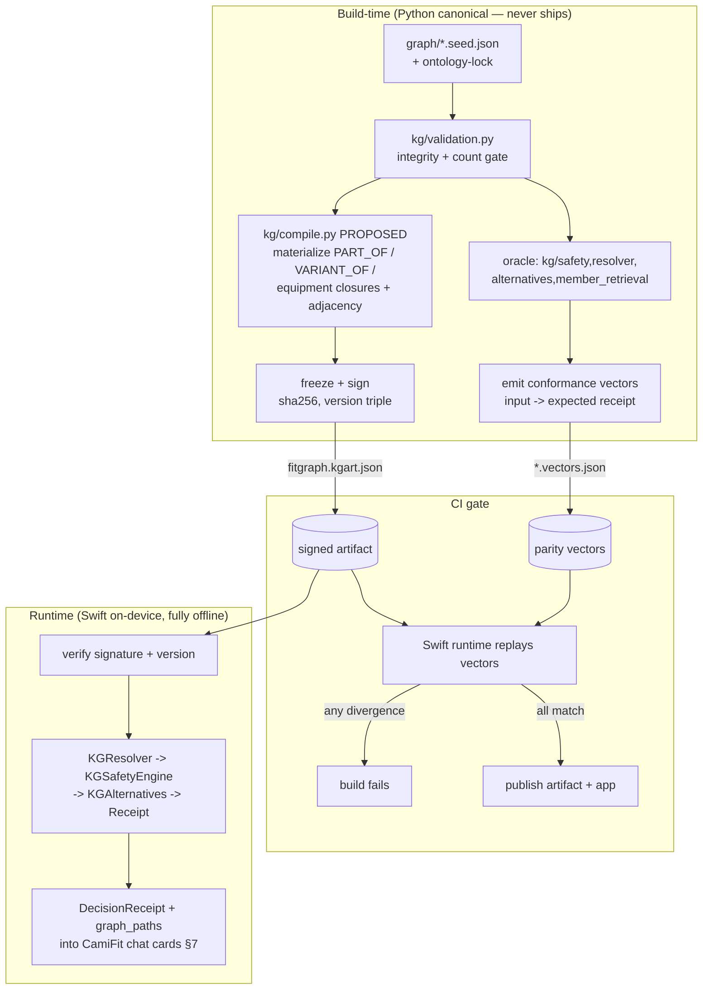

### 4.5 What is hard to port: the embedding fallback

The PRD §11 three-pass resolver (exact/alias/SKOS → fuzzy+margin → embedding) is **the only genuinely hard piece**, and the ground truth is unambiguous: it exists *only as prose*. `kg/resolver.py` ships exact/alias/canonical + a hard `UnresolvedConcept` fallback; brief 002 lists fuzzy and embedding under Out Of Scope; there are no `difflib`/cosine/levenshtein imports anywhere, no confidence thresholds, and no SKOS-label pass (MAPS_TO carries `confidence:0.0`, `external_id:null`). So a faithful port has nothing to mirror — fuzzy/embedding are new work, not a translation.

PROPOSED on-device options, in priority order, all preserving the invariant that **vector search never enforces safety** and unknown-but-safety-critical terms degrade to hard `UnresolvedConcept` (hard=True, `ask_clarification`):

| Option | Mechanism | Determinism | Safety posture |
|---|---|---|---|
| **A. Precomputed alias table (ship first)** | expand `alias_index` at build time from labels+aliases+curated synonyms; runtime is pure dictionary lookup | fully deterministic | safe — no fuzzy on safety terms |
| **B. On-device lexical fuzzy** | normalized Damerau-Levenshtein / token-Jaccard over labels+aliases, gated by type hint + margin between best and second-best | deterministic (no model) | cap output at `needs_review`; never auto-resolve a safety-critical term |
| **C. Build-time embedding expansion** | use Apple NLEmbedding / a quantized CoreML encoder *at build time* to widen the alias set; ship only the resulting alias map | runtime stays purely lexical → deterministic | embeddings expand recall offline; runtime never embeds, so safety stays graph-deterministic |
| **D. Graceful unresolved degradation (always present)** | anything unmatched → hard `UnresolvedConcept` with `safety_behavior:"ask_clarification"` | deterministic | conservative by construction — safety is never relaxed for an unknown term |

The recommended path is **A + D for v1** (closes the assessment's RES-1/RES-4 conformance floor deterministically and offline), with **B** as the first surpass and **C** as the build-time recall booster — never a runtime model. This keeps the entire serving layer offline and deterministic, satisfies the fixed "closed on-device execution loop" priority, and ensures the LLM in the coach chat (§7) only parses and verbalizes — the compiled graph, replayed in Swift and proven equal to the Python oracle, is the sole authority on eligibility and safety.

---

The shapes match the ground truth exactly. I have everything I need to write the section.

## 5. The three integration contracts

These three contracts are the only seams across which the Swift app, the on-device KG runtime, and the canonical Python oracle communicate. Everything else is internal. Each contract is a frozen, versioned JSON shape; each carries the freeze coordinates (`graph_version`, `ruleset_version`, `ontology_lock_version`) and, where a decision is involved, a `constraint_fingerprint`, so any artifact in the system can be traced back to the exact compiled graph/ruleset/lock that produced it.

```mermaid
graph LR
  EXJSON["golden exercises.json (50)"] -->|build-time importer| CAT["(1) Exercise Catalog<br/>canonical record"]
  CAT -->|project| KGN["KG nodes/edges<br/>TARGETS/STRESSES/REQUIRES/<br/>HAS_PATTERN/VARIANT_OF"]
  CAT -->|project| EP["ExerciseProgram JSON<br/>signals/rep|hold/form_rules"]
  KGN --> RT["Swift KG runtime"]
  RT -->|(2)| WCR["WorkoutCandidate +<br/>DecisionReceipt"]
  WCR --> APP["CamiFit chat/cards"]
  EP --> ENG["CamiFit pose engine"]
  ENG -->|(3)| OBS["ExercisePerformance /<br/>WorkoutSession / AdherenceObservation"]
  OBS --> MKG["Member KG"]
  MKG --> RT
```

The hard invariant binding contracts (1)→(2): only `selected`/`downranked` exercises (per fitgraph's deterministic traversal in `kg/safety.py`) may be projected into an `ExerciseProgram` and run. The LLM in the chat (`CodexAppServerClient.baseInstructions`) may *verbalize* a receipt but never produces one; eligibility is decided by graph traversal alone.

### Contract 1 — Exercise Catalog (one source, two projections)

Today there are two disconnected catalogs: the golden `exercises.json` (50 records, 14 fields — `docs/requirements/candidate-assessment/data/exercises.json`) and the 4 hand-authored CamiFit presets (`Presets/bodyweight_squat.json` et al.). FitGraph's seed (`graph/exercise_kg.seed.json`) is a hand-curated 5-exercise micro-slice that does **not** carry golden uuids. **PROPOSED:** a single canonical `CatalogExercise` record, compiled at build time by the Python importer, that is the sole upstream of both KG nodes/edges and CamiFit Exercise-Programs.

```json
// PROPOSED CatalogExercise (canonical build-time record)
{
  "source_exercise_id": "0b3178cf-bf89-45a3-bfb0-27310ef6ef38",   // golden id, preserved
  "node_id": "Exercise:barbell_decline_bench_press",              // Type:snake_case (fitgraph convention)
  "name": "Barbell Decline Bench Press",
  "muscle_groups": ["chest","triceps"],
  "joints_loaded": ["shoulder","elbow"],
  "movement_patterns": ["upper push - horizontal"],
  "equipment_required": ["Adjustable Bench - Decline","Barbell","Plate","Rack"],
  "is_bilateral": false, "side": null, "bilateral_pair_id": null,
  "priority_tier": 2, "is_reps": true, "is_duration": true,
  "supports_weight": true, "estimated_rep_duration": 0.3,
  "exercise_program_ref": "barbell_decline_bench_press",          // → ExerciseProgram.id, or null if unmodeled
  "source_file": "exercises.json", "source_hash": "<sha256>",
  "graph_version": "fitgraph-kg-m5-validation-v0"
}
```

**Field mapping — golden → KG edges** (the importer must hit the synthesis-plan exact counts; CI fails on any silently dropped field per `docs/candidate-assessment-fitgraph-synthesis-plan.md` lines 287–296):

| Golden field | KG projection | Notes |
|---|---|---|
| `muscle_groups[]` | `Exercise -TARGETS-> MuscleGroup:<slug>` | 19-vocab; powers `target_overlap` Jaccard in alternatives (`kg/alternatives.py:_targets`) |
| `joints_loaded[]` | `Exercise -STRESSES-> BodyRegion:<slug>` | 9-vocab; **conservative** edge only — the 7-key STRESSES bundle (`load_level/impact_level/flexion_depth/loaded/axial_load/balance_demand/laterality`) has **no upstream source** and is enriched by an authored curation table keyed by `(movement_pattern × joint)`. This is the safety-critical layer (synthesis plan line 339). |
| `movement_patterns[]` | `Exercise -HAS_PATTERN-> MovementPattern:<slug>` | 36-vocab; powers `movement_pattern_similarity` |
| `equipment_required[]` | `Exercise -REQUIRES-> Equipment:<slug>` | 32-vocab; AND semantics → the subset gate in `kg/safety.py:_equipment_reasons` |
| `is_bilateral`/`side`/`bilateral_pair_id` | `STRESSES.laterality` + PROPOSED `BILATERAL_PAIR_OF` edge | golden semantics are inverted: `is_bilateral=true` ⇒ the *unilateral left twin*; right twins absent. Importer must materialize laterality so Jordan's **left**-knee restriction down-ranks only the affected side. |
| `priority_tier` | `Exercise.properties.priority_score` | golden is **constant 2** — inert signal; 0.10 weight in `_weighted_score`. Synthesize a derived complexity score or document the constant. |
| `is_reps`/`is_duration`/`supports_weight`/`estimated_rep_duration` | `Exercise.properties` (carried, not edges) | drives ExerciseProgram projection + time-window→volume math (WG-5). |
| — (no field) | `Exercise -VARIANT_OF-> ExerciseFamily:<slug>` | **authored**, not derivable. Required for "exclude deadlifts" — zero catalog exercises are named "deadlift" (golden fact). |

**Field mapping — canonical → CamiFit Exercise-Program** (`Sources/CamiFitEngine/ExerciseProgram.swift:27-87`): this is a *partial, mechanical* projection that must respect the **runtime DSL intersection** (only `abs`/`angle`/`angle_to_vertical` execute — `Sources/CamiFitEngine/Expression/Evaluator.swift:97-118`). Not every catalog exercise is poseable; `exercise_program_ref` is null when no program exists.

| Canonical field | ExerciseProgram target | Rule |
|---|---|---|
| `node_id` slug | `id` (non-empty), `name` | direct |
| `is_reps` | emit `rep` block, `hold:null` | rep XOR hold (`ProgramLoader.swift:132-138`) |
| `is_reps=false`/`is_duration` | emit `hold` block, `rep:null` | + must still set `set.target_reps` since `SetProgressTracker` only consumes reps (`SetProgressTracker.swift:40-54`) |
| `joints_loaded` + `movement_patterns` | `signals`/`form_rules` | derived from an authored archetype library (e.g. squat → `knee = angle(hip,knee,ankle)`), **not** auto-synthesized from joints alone |
| `setup.required_view` | from movement archetype | side vs front |

**Trackability classification.** The graph can prove an exercise is safe before
CamiFit can prove it is pose-trackable. The bridge must preserve that
difference instead of treating every selected candidate as runnable.

| Status | Meaning | Product behavior |
|---|---|---|
| `trackable_curated` | A vetted bundled `ExerciseProgram` exists. | Routine block may start live tracking with the confidence of its existing fixtures. |
| `trackable_template` | A pattern template can emit an `ExerciseProgram` that passes load + dry-run. | Routine block may start live tracking, labelled as template-generated until fixture-backed. |
| `trackable_generated` | The coach/LLM emitted a structurally valid inline program, but it is not calibrated. | User may save/run it with "Generated - may need tuning"; no accuracy claim. |
| `timer_or_manual` | The exercise is safe and schedulable but lacks reliable pose grading. | Include as a timed/manual block; write back completion/adherence, not rep/form quality. |
| `recommendation_only` | The exercise is safe and useful, but outside current app execution scope. | Show in the plan with a trackability warning or request a substitute. |
| `filtered` | The graph hard-blocked, excluded, or otherwise removed it. | Never include as a runnable block; show receipt/provenance. |

This taxonomy is the guardrail between "contain the assessment" and "surpass
with execution." The assessment can accept safe recommendations; CamiFit should
only promise live pose grading for the trackable tiers.

Every projected program must survive the same gate the chat already enforces: decode via `ProgramLoader.load` + dry-run through `FrameSignalProcessor` (`Sources/CamiFitApp/Regimen/RegimenBlockParser.swift`).

### Contract 2 — Workout-Candidate + Decision-Receipt (KG runtime → app)

This is the output the chat/cards consume. It is a **faithful port** of fitgraph's live shapes — `DecisionReceipt` (10 required fields, `kg/provenance.py:13-24` + `kg/safety.py`) and `AlternativeRecord`/`WorkoutCandidateResult` (`kg/alternatives.py:12-30`). No re-design; the Swift port must reproduce these byte-shapes and pass the Python oracle's conformance vectors.

```json
// DecisionReceipt — ported verbatim from kg/safety.py DecisionReceipt
{
  "exercise_id": "Exercise:goblet_squat",
  "decision": "filtered",                          // selected | filtered | downranked
  "primary_severity": "MEDICAL_HARD_BLOCK",        // lattice: MEDICAL>EQUIPMENT>PROMPT>DISLIKE>SOFT>BOOST
  "reason_codes": ["ACTIVE_KNEE_RESTRICTION"],
  "primary_reason_code": "ACTIVE_KNEE_RESTRICTION",
  "graph_paths": [
    "Exercise:goblet_squat -STRESSES-> BodyRegion:left_knee",
    "BodyRegion:left_knee -PART_OF-> BodyRegion:knee",
    "SafetyRule:avoid_loaded_knee_flexion -USES_CONCEPT-> BodyRegion:knee"
  ],
  "constraint_fingerprint": "<sha256hex[:16]>",    // stable_fingerprint, sort_keys=True (provenance.py)
  "graph_version": "fitgraph-kg-m5-validation-v0",
  "ruleset_version": "ruleset-m2-safety-v0",
  "ontology_lock_version": "ontology-lock-m0-unverified"
}
```

```json
// WorkoutCandidateResult — kg/alternatives.py:24-30
{
  "selected_receipts": [ /* DecisionReceipt[] */ ],
  "filtered_receipts": [ /* DecisionReceipt[] */ ],
  "alternatives": [{
    "filtered_exercise_id": "Exercise:goblet_squat",
    "alternative_exercise_id": "Exercise:glute_bridge",
    "derived_from": "Exercise:goblet_squat",
    "score": 0.4275,                               // round(0.45·target+0.35·pattern+0.10·equip+0.10·tier, 6)
    "score_components": {"target_overlap":0.5,"movement_pattern_similarity":0.0,
                         "equipment_preference":1.0,"priority_tier":0.9},
    "graph_paths": ["Exercise:goblet_squat -TARGETS-> MuscleGroup:glutes", "..."]
  }]
}
```

Determinism levers the Swift port **must** preserve (from `kg/`): sort nodes by id (`_exact_label_or_alias_match`), sort closure edges by source/target, tie-break alternatives by `(-score, alternative_id)`, `round(...,6)`, and fingerprint over sorted-key JSON. Alternatives are drawn **only** from the `selected` pool (`kg/alternatives.py:133-182`); empty safe pool ⇒ zero alternatives. **PROPOSED app envelope:** a `WorkoutPlan` wrapping `WorkoutCandidateResult` with warmup/main/cooldown blocks and sets/reps/rest (WG-2). Each block carries both the selected graph exercise and its trackability status. Only `trackable_curated`, `trackable_template`, and validated `trackable_generated` blocks become `WorkoutRoutine` executable blocks; `timer_or_manual` and `recommendation_only` blocks stay visible in the plan but do not claim live pose grading. The chat-side dangling-preset-id risk (`AppExerciseSessionViewModel.activateBlockExercise`, swallowed `try?`) is closed because executable blocks reference only preset/program IDs proven by the compiled artifact or by `ProgramLoader` validation.

### Contract 3 — Member-Graph + Observation (execution → member KG write-back)

This is the surpass contract (the closed loop, §6) and is **entirely PROPOSED** — no write-back exists today. The CamiFit engine already produces the raw material: `RepStateMachine` counts, `HoldEvaluator.heldSeconds`, `FormRuleScoreSummarizer` weighted score, `SetProgressTracker` completion (`Sources/CamiFitEngine/*`). The member KG (`graph/member_kg.seed.json`) currently has the read side only (`AdherenceObservation` x2). Write-back appends typed, provenance-anchored observation nodes that the next KG resolve/safety pass reads — every node carries `DERIVED_FROM -> SourceSpan` per the existing member-KG invariant.

```json
// PROPOSED ExercisePerformance node (from one completed set)
{
  "id": "ExercisePerformance:jordan_2026-06-04T18:05_goblet_squat_box_s1",
  "type": "ExercisePerformance",
  "properties": {
    "member_id": "Member:jordan",
    "exercise_node_id": "Exercise:goblet_squat_box_supported",
    "decision_fingerprint": "<constraint_fingerprint from the receipt that authorized this set>",
    "completed_reps": 8, "target_reps": 10, "held_seconds": null,
    "form_score": 0.86, "cue_codes": ["depth","torso"],
    "rom_deg_mean": 92.4, "tracking_quality": "good",
    "graph_version": "fitgraph-kg-m5-validation-v0",
    "ruleset_version": "ruleset-m2-safety-v0",
    "ontology_lock_version": "ontology-lock-m0-unverified",
    "occurred_at": "2026-06-04T18:05:11Z"
  }
}
// edges: Member -HAS_PERFORMANCE-> ExercisePerformance
//        ExercisePerformance -OF_EXERCISE-> Exercise:...
//        ExercisePerformance -DERIVED_FROM-> SourceSpan (the engine trace)
```

```json
// PROPOSED WorkoutSession + rolled-up AdherenceObservation
{ "id":"WorkoutSession:jordan_2026-06-04", "type":"WorkoutSession",
  "properties":{"member_id":"Member:jordan","planned":true,"completed":true,
    "duration_min":31,"performances":["ExercisePerformance:..."],
    "decision_fingerprints":["<fp1>","<fp2>"]} }
{ "id":"AdherenceObservation:jordan_week_2026_06_02", "type":"AdherenceObservation",
  "properties":{"week_start":"2026-06-02","completed_sessions":3,"planned_sessions":4} }
```

The `decision_fingerprint`/`graph_version` stamps make the loop auditable end-to-end: a future safety pass can prove *which* frozen artifact authorized a set, and `member_retrieval.adherence_trend` (`kg/member_retrieval.py`) recomputes its declining-adherence fact card from live `AdherenceObservation`s rather than seed data. Write-back must **never** mutate exercise-graph nodes or relax safety — observations are additive member-context facts only; the local taxonomy stays authoritative, MAPS_TO stays audit-only, and nothing in this path lets execution telemetry decide eligibility.

### Versioning rule across all three contracts

Every contract instance stamps the three freeze coordinates; every decision/observation also stamps `constraint_fingerprint`. **Today these versions are inconsistent** — receipts read `GRAPH_VERSION` from `kg/validation.py` (`fitgraph-kg-m5-validation-v0`) while the seed file declares `fitgraph-kg-m3-alternatives-v0`, and `ONTOLOGY_LOCK_VERSION` is a hardcoded constant in `kg/safety.py`, not read from `graph/ontology-lock.json`. **PROPOSED:** the build-time compiler emits one content-hashed artifact version derived from the merged graph+ruleset+lock, and all three contracts read it from the loaded artifact — a single source of truth the Swift runtime verifies on load, so a receipt, an alternative, and a write-back observation produced in the same session are provably bound to the same frozen graph.

---

## 6. The closed execution loop - the surpass

The assessment's Workout Generator ends at a rendered plan in a browser (`ASSESSMENT.md` WG-2, lines 21-33). CamiFit's surpass is that the plan does not terminate at render — it **compiles into runnable Exercise-Programs, executes on-device against the pose engine, grades reps/form/sets, and writes performance observations back into the member KG** so the next generation adapts. This is the closed loop. It is the one thing neither FitGraph (`/Users/kelly/Developer/fitgraph/kg/`) nor the candidate-assessment floor has any mechanism for. Everything in this section after the resolver→safety→alternatives stage is PROPOSED build; the engine and chat surfaces it lands on are real.

### 6.1 The loop end to end

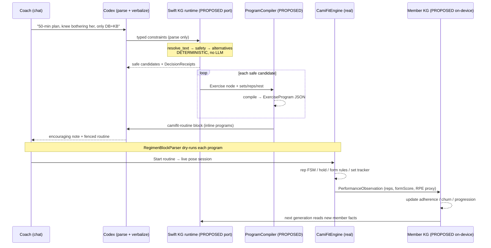

### 6.2 Stage 1 — resolve → safety → alternatives (deterministic, ported)

This is FitGraph's live logic (`kg/resolver.py`, `kg/safety.py`, `kg/alternatives.py`) ported to Swift per the fixed two-layer decision (§4, §5). The LLM's only job here is to turn "her left knee is bothering her, only DB and KB" into typed constraints — it **never decides eligibility**, honoring `runtime_policy.llm_decides_safety:false` (`graph/safety_rules.seed.json`) and the assessment's "graph traversal, not a sentence in the prompt" (`ASSESSMENT.md` line 116). Output is the safe pool (receipts with `decision=="selected"`, `kg/alternatives.py:133-182`) plus one `DecisionReceipt` per candidate carrying `graph_paths` evidence. Contract details are §5.

### 6.3 Stage 2 — the compile (the hard part)

Each safe Exercise node + its prescribed `{sets, reps|holdSeconds, rest}` must become an `ExerciseProgram` (the 13-field contract at `Sources/CamiFitEngine/ExerciseProgram.swift:27-87`) — the exact artifact the engine loads. This is hard because the golden catalog (`docs/requirements/candidate-assessment/data/exercises.json`) describes exercises *semantically* (`muscle_groups`, `joints_loaded`, `movement_patterns`, `equipment_required`), while an `ExerciseProgram` demands *biomechanical executability*: signal DSL expressions over MediaPipe landmarks, a rep FSM with `down_when`/`up_when` predicates, ROM gates, and form rules. **There is no field in the golden data that yields `angle(primary.hip, primary.knee, primary.ankle)`.** That mapping is authored, not derived.

The compiler is therefore tiered by how much pose intelligence a movement_pattern admits:

| Tier | Mechanism | Coverage | What's emitted |
|---|---|---|---|
| **T0 Preset** | Reuse an existing camifit preset by id | `bodyweight_squat`, `pushup`, `lunge`, `plank` (`Presets/`) | `ExerciseRef.preset(id)` — no compile, full pose grading |
| **T1 Pattern template** | Parameterized template keyed by `movement_pattern` → fills landmarks/predicates from a curated table | squat / split-squat / hinge / horizontal-press / vertical-pull patterns | full `ExerciseProgram` with rep FSM + form rules |
| **T2 Generic-rep** | Movement-agnostic rep counter on a single dominant joint angle (no form rules) | any `is_reps:true` exercise with a known primary joint | rep program, minimal form rules |
| **T3 Timer/manual** | `hold` block on a trivially-true predicate, or pure set/rest timer with manual rep entry | `is_reps:false` holds, machine/cardio exercises with no usable side-view signal | hold program or timer-only block |

The catalog supports this tiering because every record is `is_duration:true` (verified, §3), so **every exercise is at least timer-*runnable*** — none is unschedulable. But *runnable* is not *pose-graded*: a T3 timer/manual block emits **no rep/form telemetry**, so the §6.6 write-back fields (`counted_reps`, `form_score`, `dominant_cue`) are empty for it. The graded-execution moat (§1, §10) therefore covers only the **pose-tracked tiers (T0/T1/T2-pose) — realistically ~12 of 50 on day one** (§6.4); the rest still contribute completion/adherence signal, just not form grading. This makes the candidate→`ExerciseProgram` compiler the load-bearing surpass risk (R-compile, §11), not a convenience. `estimated_rep_duration` + the WG-1 time window drive set/rep volume (WG-5).

**Templatable vs hand-authored.** The line is the movement_pattern's signal geometry:

- **Templatable (T1):** patterns whose phase signal is a single well-known joint angle from a single required view. `lower push - squat` and `lower push - split squat` → knee-angle FSM identical in shape to `Presets/bodyweight_squat.json` (`down_when:"knee < 100"`, `up_when:"knee > 160"`, `min_rom_deg:50`); `lower pull - hip lift` → hip-angle; `upper push - horizontal` → elbow-angle. A PROPOSED `PatternProgramTemplate` table maps `movement_pattern → {required_view, phase_signal expr, down/up thresholds, default form_rules}`. The signal DSL it emits stays inside the **runnable intersection** the engine actually executes (`angle`, `angle_to_vertical`, `abs`, `+ - * /`, single-comparison predicates — `Sources/CamiFitEngine/Expression/Evaluator.swift:97-118` implements only 3 of 10 allowlisted functions; `distance`/`ratio`/`midpoint` must not be emitted until implemented).
- **Hand-authored (PROPOSED, ~T1 exceptions):** patterns where one angle is insufficient — `core - anti-rotation`, `balance`, `mobility - dynamic` need bespoke signals or composite logic the current single-comparison predicate grammar can't express (compound rules must be split into separate `form_rules`, a real limitation flagged in the engine surpass list). These get curated programs or fall to T2/T3.

**Compile-time safety gate.** Every compiled program must pass the *same* validation the chat already enforces: `ProgramLoader.load` + a dry-run through `FrameSignalProcessor` (`Sources/CamiFitApp/Regimen/RegimenBlockParser.swift` `validateExercise`). A T1 template that emits a runtime-invalid signal is rejected and demoted to T2/T3 automatically. This makes the coverage ladder self-healing: correctness is enforced by the engine, not trusted from the generator.

### 6.4 The 50-exercise coverage ladder (concrete plan)

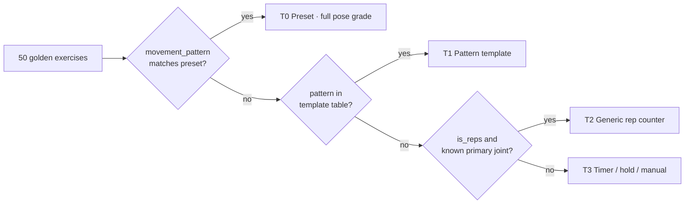

Concrete first-pass allocation against the verified vocabulary (§3): the squat-family patterns (`lower push - squat`(3), `lower push - split squat`(3), `lower push - lunge`(2)) and the press patterns (`upper push - horizontal`(5)) map to **T0/T1** — roughly a dozen exercises with real pose grading on day one. The `is_reps:true` remainder (42 of 50 are reps-prescribable) gets **T2**. The 8 `is_reps:false` holds (Copenhagen Plank, carries, stretches — verified §2a) get **T3 hold** programs (`hold` block, `target_seconds` from the time window). Everything else (cardio machines, `SkiErg`, `Stair Climber`) gets **T3 timer**. The deliverable is a checked-in coverage manifest: `{exercise_id → tier}` with CI asserting 100% of 50 are assigned and 0 are unrunnable — turning the assessment's golden catalog into CamiFit's golden *execution* acceptance test, the surpass analogue of FitGraph's conformance importer count gate (§9).

### 6.5 Stage 3 — execute and grade (real engine, today)

The compiled `WorkoutRoutine` flows through the existing path: `RegimenCard` "Start routine" → `AppExerciseSessionViewModel.startRoutine` → `activateBlockExercise` (`.inline` programs are validated, saved as user presets, and selected — `Sources/CamiFitApp/AppExerciseSessionViewModel.swift`). Live frames run through `EngineTraceRecorder.record(frame:)`: signals → filters → rep FSM (`RepStateMachine.swift`) or hold accumulator (`HoldEvaluator.swift`) → form rules (`FormRuleEvaluator.swift`, weighted score) → `SetProgressTracker.advance`. The user sees reps, hold seconds, form cues, and a per-set score — **objective execution data the assessment never produces.**

### 6.6 Stage 4 — write back to the member KG (the close)

Here the loop closes. The engine already computes everything needed; what's missing is a member-KG sink. PROPOSED node, mirroring FitGraph's member-graph envelope (`graph/member_kg.seed.json`) and DERIVED_FROM provenance:

```json
{ "id": "ExercisePerformance:jordan_2026_06_04_squat_set1",
  "type": "ExercisePerformance",
  "properties": {
    "exercise_id": "Exercise:bodyweight_squat",
    "prescribed_reps": 10, "counted_reps": 7,
    "form_score": 0.72, "dominant_cue": "Go deeper",
    "completed": false, "rpe_proxy": 8,
    "session_date": "2026-06-04" } }
```

`counted_reps`/`completed` come from `SetProgressTracker`; `form_score`/`dominant_cue` from `FormRuleScoreSummarizer.summarize`; `rpe_proxy` is a PROPOSED *derived estimate*, tagged `confidence:"derived"` (never `"deterministic"`) and kept in its own field so it can never masquerade as measured member data — the copilot must label it an estimate, and the real signal is a one-tap post-set RPE prompt (PROPOSED), with the proxy used only when the member skips it. This honors the CP-6 invariant that member facts are grounded, not invented (`kg/member_retrieval.py` fact cards stay `confidence:"deterministic"`). These are appended as `Member -HAS_EXERCISE_PERFORMANCE-> ExercisePerformance` edges, each `DERIVED_FROM` an engine-trace `SourceSpan` — so every member fact stays provenance-anchored, exactly as `kg/member_retrieval.py` requires (`source_nodes` chained via DERIVED_FROM).

New performance feeds the existing fact-card queries: a new `HAS_ADHERENCE_OBSERVATION` derived from `completed`, recomputing the adherence trend and `churn_risk` (`kg/member_retrieval.py` `adherence_trend`, `churn_risk`). **The next generation reads these facts deterministically**: a candidate the member repeatedly fails (low form score, missed reps) is down-ranked via a PROPOSED `SOFT_PENALTY` reason — finally exercising the lattice branch FitGraph defined but never emits (`MEMBER_STRONG_DISLIKE`/`SOFT_PENALTY` are reachable-but-unexercised, per the safety teardown). Progression (add reps after clean completion) is symmetric. Crucially, this stays a **soft** signal: performance can down-rank or boost, but it can **never override** a `MEDICAL_HARD_BLOCK` or equipment block — preserving the lattice precedence and the rule that safety is never relaxed (`SEVERITY_LATTICE`, `kg/safety.py:14-21`).

### 6.7 The determinism / LLM boundary

| Stage | Decider | LLM role |
|---|---|---|
| Parse prompt → constraints | LLM | **parse only** (verbalize free text → typed constraints) |
| Resolve / safety / alternatives | Swift KG (deterministic traversal) | none — `llm_decides_safety:false` |
| Compile candidate → ExerciseProgram | Deterministic template + engine dry-run | none |
| Execute / grade | Pose engine (deterministic FSM) | none |
| Write-back → adherence/churn/progression | Deterministic graph update | none |
| Render note + fenced routine | LLM | **verbalize only** — encouraging text around graph-authored JSON |

The LLM bookends the loop (parse in, verbalize out) and touches nothing in the middle. Every keep/drop/down-rank still emits a `DecisionReceipt` with `graph_paths`; every member number still traces to a `SourceSpan`.

### 6.8 The contain-vs-surpass line

The assessment is **satisfied** at Stage 1–2 render: a graph-driven plan with provenance (`ASSESSMENT.md` WG-1..4). CamiFit **contains** that floor (same resolver, same lattice, same receipts — §10 ledger) and then **surpasses** it on the axis no competitor has: Stages 3–4. The assessment stops at "here is a safe plan." CamiFit answers "did she actually do it, how well, and what should change next" — a closed on-device execution loop that converts a one-shot recommendation into a learning system. That is the moat (§1 thesis), and it is built entirely on already-real engine and chat surfaces, requiring only the PROPOSED ProgramCompiler and member-KG write-back to close.

---

## 7. Coach copilot inside the CamiFit chat

CamiFit already ships the entire transport, streaming, and rendering spine the assessment Copilot requires. `ChatViewModel` (`Sources/CamiFitApp/ContentView.swift`) holds `[ChatMessage]` + a draft, streams through `CodexAppServerClient.startTurn(text:onDelta:onComplete:onError:)` (`Sources/CamiFitApp/CodexAppServerClient.swift`), and on `turn/completed` runs `RegimenBlockParser.parse(message:)` to materialize fenced artifacts into cards beneath the bubble (`Sources/CamiFitApp/Regimen/RegimenBlockParser.swift`, `RegimenCard.swift`). The Copilot is **not a new surface** — it is a second card grammar and a retrieval pre-step bolted onto this exact pipeline. Today the "brain" is generic Codex/ChatGPT with no graph and no retrieval (the only domain knowledge is one embedded few-shot `ExerciseProgram` in `CodexAppServerClient.baseInstructions`), so any number it states about Jordan is hallucinated. That is the gap this section closes.

### The hard rule, mechanized

The fitgraph invariant — *the LLM parses and verbalizes but never decides; numeric answers come from graph queries* — maps onto a fact-card contract that mirrors fitgraph's `FactCard{claim, confidence:"deterministic", source_nodes, query}` (`/Users/kelly/Developer/fitgraph/kg/member_retrieval.py`). The flow is: resolve intent → run the deterministic `member_retrieval` query in the ported Swift KG runtime (Section 4) → render a **fact card before any prose** → hand the LLM *only* the fact cards as grounding. Every number on screen comes from a `source_nodes` chain (`DERIVED_FROM -> SourceSpan`), never from token generation. When the graph has no fact, `member_retrieval` already returns the canonical `_missing_card` ("The graph has no supporting fact for {member_id}.") — the LLM is instructed to say exactly that, not improvise. This is CP-6 enforced structurally, not by prompt hope.

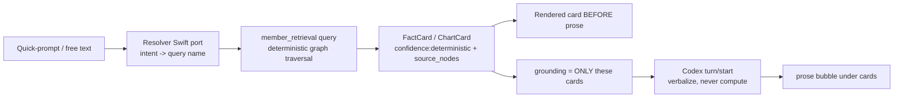

### PROPOSED card grammar

Three new `RegimenBlockKind`-style fenced tags extend the existing parser (which today recognizes only ` ```camifit-exercise ` and ` ```camifit-routine `, `RegimenBlockParser.extractBlocks`). But unlike exercise/routine blocks — which the *LLM emits* — copilot cards are **emitted by the app from graph queries**, then optionally referenced by the LLM. PROPOSED: a `CopilotResult` enum sibling to `RegimenResult`, rendered by a `FactCardView`/`ChartCardView` analogous to `RegimenCard`. The card is constructed app-side the moment the resolver picks a query, so it renders even if the Codex turn stalls (the 120s watchdog in `CodexAppServerClient` already guarantees the UI never hangs).

### Quick-prompt and chart → query → fact-card mapping

The palette extends the existing `ChatEmptyState` starter prompts (`ContentView.swift`). Each maps to exactly one ported `member_retrieval` function. All seven fitgraph queries (`/Users/kelly/Developer/fitgraph/kg/member_retrieval.py`) are reused verbatim in semantics; rows marked PROPOSED-query need a new deterministic traversal over the same Jordan member graph.

| Assessment surface (req) | Member-facing label | Coach-facing label | `member_retrieval` query | Returns (fact card claim shape) | source_nodes chain |
|---|---|---|---|---|---|
| `Show me the brief` (CP-2/CP-3) | "Today's focus" | "Morning brief" | `coach_brief` | `generated_for` + brief `text` | CoachBrief + DERIVED_FROM SourceSpans |
| `How's adherence trending?` (CP-3) | "How am I doing?" | "Adherence trend" | `adherence_trend` | "Adherence declined from 100% (4/4)… to 50% (2/4)…" | first + latest AdherenceObservation |
| `Sleep this week` (CP-3) | "My sleep" | "Sleep this week" | `sleep_this_week` | avg of `sleep_hours` last_7_days, `{:.1f}` | BiomarkerObservation(sleep) |
| `What changed since last week?` (CP-3) | "What's new" | "Week-over-week" | `adherence_trend` + `sleep_this_week` (PROPOSED `week_delta` aggregator) | composite delta claim | union of above source_nodes |
| Churn risk (CP-7) | *(suppressed — see role framing)* | "Churn risk" | `churn_risk` | `risk_level`, `observed_at`, joined `reasons` | ChurnSignal |
| Goals/equipment context (CP-1) | "My equipment" / "My goals" | same | `available_equipment` / `goals` | equipment labels / active goals | EquipmentAvailability / Goal |
| Active injuries (CP-1, SAF context) | "My recovery" | "Active restrictions" | `active_injuries` | region + start date | InjuryEpisode |
| **Chart: Plot adherence trend** (CP-4) | "Adherence chart" | same | `adherence_trend` (PROPOSED returns full `weekly_completion_pct[4]` series, not just first/latest) | 4-point series → SwiftUI `Chart` | all 4 AdherenceObservations |
| **Chart: Sleep this week** (CP-4 extension) | "Sleep chart" | same | `sleep_this_week` (PROPOSED returns 7-value array) | 7-point series | BiomarkerObservation(sleep) |
| **Chart: Compare last 4 weeks** (CP-4) | "Last 4 weeks" | same | PROPOSED `compare_last_4_weeks` over adherence+sleep+weight_trend | grouped bars/lines | AdherenceObs×4 + Biomarker + weight SourceSpans |
| **Chart: Show message pattern** (CP-4/CP-5) | *(coach-only)* | "Message pattern" | PROPOSED `message_pattern` over `chat_history[]` timestamps | per-day message counts (count is deterministic; **content stays vector-retrieved, never safety**) | Message/SourceSpan nodes |

Three of these queries are extensions of existing functions rather than net-new logic: `adherence_trend` already sorts AdherenceObservations by `week_start` and compares first vs latest, so returning the full series for the chart is a serialization change, not new traversal. The PROPOSED `compare_last_4_weeks` and `message_pattern` are new deterministic aggregators but require **no new node types** — the golden member already carries `adherence.weekly_completion_pct[4]`, `biomarkers.sleep_hours_last_7_days[7]`, `biomarkers.weight_trend_kg[3]`, and `chat_history[4]` (`docs/requirements/candidate-assessment/data/member-context.json`).

### Morning brief + churn via hybrid retrieval

The morning brief is two deterministic queries composed: `coach_brief` (the celebrate + review_risk tasks) and `churn_risk`. The golden `coach_brief.morning_tasks[0]` is *celebrate yesterday's session* and `[1]` is *check churn (adherence 100% → 50%)* — both already structured in the member graph. The **graph supplies the facts** (the 100→50 numbers, the churn `level:"elevated"` and its three `reasons`); the **LLM supplies the empathetic phrasing** ("Nice work on the box squats — first pain-free squat session since the flare-up"). Where vector retrieval legitimately enters is *only* CP-5 narrative context: free-text chat history, image captions, the "knee felt okay with the box squats" message. That retrieval colors tone and recall — it **never** decides a number or a safety verdict, consistent with the non-negotiable that vector search never enforces safety and MAPS_TO is audit metadata only. Concretely: churn *level* is read from `ChurnSignal.risk_level` (deterministic), churn *explanation* may pull the relevant chat message verbatim via vector recall, and the receipt-style `source_nodes` make both traceable.

### Member-facing vs coach-facing: PROPOSED shared surface with a role gate

The fixed decision is that the hero is a member-facing on-device app, yet the assessment's Copilot is explicitly a *coach* dashboard (congratulate the member, assess churn). These are reconcilable without two apps. **Proposal: one chat surface, a `CopilotRole` toggle (`.member` | `.coach`), defaulting to `.member`, switchable in the existing `CamiFitSettingsView` account scene** (`ContentView.swift`) where the ChatGPT login already lives — the same place that already encodes identity. Justification:

1. **The data is identical; the framing differs.** Every `member_retrieval` query runs against the same Jordan graph. Role does not change *what is true*, only *who is addressed* and *what is exposed*. Churn-risk and message-pattern cards are clinically/relationally sensitive — surfacing "you're at risk of churning" to the member is counterproductive — so `.member` mode **suppresses** the `churn_risk` and `message_pattern` cards and reframes `coach_brief` as "Today's focus." This is a pure render-layer filter over the same deterministic facts; no query is duplicated.
2. **It honors the on-device, single-binary topology.** A separate coach app would fork the monorepo's serving runtime. A role flag keeps one `ChatViewModel`, one ported KG runtime, one card renderer.
3. **It maps cleanly to the existing identity seam.** `profile.coach_id: "coach_01HXSAM"` and `profile.id: "mbr_01HX9JORDAN"` already exist in the golden member; the role toggle is the UI expression of which identity is driving the session. PROPOSED: persist the chosen role alongside the account detail `CodexAppServerClient.accountDetail` populates.
4. **The closed loop (Section 6) feeds both roles from the same writes.** When the on-device engine writes rep/hold/form-score results back into the member KG, the member sees "first pain-free squat work" and the coach sees the same observation as adherence/recovery evidence — one write, two framings.

The brain swap is the one structural change the chat surface needs, and the seam already exists: `chat.codex` is an injected dependency at the `ChatViewModel` boundary (`ContentView.onAppear` does `chat.codex = codex; codex.start()`), so the resolver→`member_retrieval`→fact-card pre-step and the role-aware grounding injection slot in *in front of* `startTurn` without touching the streaming-callback contract. The LLM keeps its job — parse the request, verbalize the cards — and never inherits the one job the graph owns: deciding what is true.

---

## 8. Monorepo migration and dual autonomous loops

CamiFit and FitGraph are today two independent git repos, each driven by an identical autonomous Codex executor/reviewer loop. The fusion (thesis, §1) requires collapsing them into one monorepo **without stalling either loop and without losing the history that justifies every prior reviewer decision**. The hard part is not the file moves — it is that both loops poll the same control surface (`GOAL.md`, `.codex-goal-loop.pid`, `scripts/run_codex_pair_cycle.sh`) and would collide on a shared `GOAL.md` and a shared root PID file. This section sequences a safe migration and proposes the per-loop isolation that lets them coexist.

### 8.1 What exists today (both repos, verified)

| Artifact | CamiFit | FitGraph | Note |
|---|---|---|---|
| Mission file | `/Users/kelly/Developer/camifit/GOAL.md` (M3 productize) | `/Users/kelly/Developer/fitgraph/GOAL.md` (EOD, slice `docs/briefs/011-jordan-plyometric-knee-safety.md`) | Both define **Stop Conditions** incl. literal `<stop-orchestrator/>` sentinel |
| Loop driver | `scripts/start_codex_goal_loop.sh`, `stop_codex_goal_loop.sh`, `run_codex_pair_cycle.sh` | same filenames | Identical machinery in both `scripts/` dirs |
| Live PID | `.codex-goal-loop.pid` is per-root; **no camifit loop runs today** (camifit is driven interactively / via Codex.app sessions on `feat/chat-regimen`) | only fitgraph runs the supervised loop (§2) | because `stop` reads `$ROOT/.codex-goal-loop.pid`, disjoint roots never collide |
| Build/test | `swift test` (Package.swift: `CamiFitEngineTests`, `CamiFitAppTests`) | `uv` + `pytest` (`pyproject.toml`, `uv.lock`; exact test count pinned by commit) | Two toolchains |
| CI | **none** — no `.github/workflows` (PROPOSED) | **none** — no `.github/workflows` (PROPOSED) | CI is greenfield |
| Role docs | `executor-reviewer-pair-programming.md`, `docs/autonomous-workflow/*` | same + `AGENTS.md` | fitgraph has the richer guardian protocol |

The `<stop-orchestrator/>` sentinel (a FitGraph `GOAL.md` Stop Condition) is the clean lever: writing it into a loop's `GOAL.md` halts that loop at the next cycle boundary without `kill`. This is the safe pause primitive the migration leans on.

### 8.2 Proposed package layout

```
camifit/                      # monorepo root (keep the camifit repo as the hero base)
├─ apps/
│  └─ macos/                  # MOVED Sources/CamiFitApp + Resources, Presets/
├─ engine/                    # MOVED Sources/CamiFitEngine (ExerciseProgram, ProgramLoader, Expression/*)
├─ kgkit/                     # PROPOSED Swift KG runtime — the §5/§9 Swift port of fitgraph/kg/*
├─ kg-canonical/             # MOVED fitgraph/kg/*.py + pyproject.toml + uv.lock (build-time oracle only)
├─ contracts/                 # PROPOSED shared schemas (§5): ExerciseProgram.schema.json, DecisionReceipt, conformance vectors
├─ data/
│  ├─ golden/                 # from camifit docs/requirements/candidate-assessment/data/ (fitgraph keeps a 2nd copy at docs/external/ — dedupe on merge)
│  └─ seed/                   # MOVED fitgraph/graph/*.seed.json + ontology-lock.json + safety_rules
├─ artifact/                  # PROPOSED frozen compiled+signed graph artifact the Swift runtime loads
├─ loops/
│  ├─ app/   GOAL.md  .codex-goal-loop.pid   # camifit loop, relocated
│  └─ kg/    GOAL.md  .codex-goal-loop.pid   # fitgraph loop, relocated
├─ scripts/                   # unified loop drivers (per-loop ROOT arg)
├─ docs/
└─ Package.swift              # multi-target: CamiFitEngine, KGKit, CamiFitApp
```

`Package.swift` gains a `KGKit` library target (depended on by `CamiFitApp`, not `CamiFitEngine` — the engine stays pose-only per its design). `kg-canonical/` keeps its own `pyproject.toml`/`uv.lock`; **it never ships at runtime** (fixed decision): it compiles `data/seed/*` + `kg/validation.py` into `artifact/` plus conformance vectors that `kgkit/` must replay in CI.

### 8.3 Dual autonomous loops: isolate, don't merge

Merging the two loops into one `GOAL.md` would force one executor to context-switch between Swift pose-engine work and Python KG work every cycle — and would make the single root `.codex-goal-loop.pid` a contention point. **Keep them as two loops with disjoint control surfaces and disjoint write scopes.** `stop_codex_goal_loop.sh` already takes a `ROOT` argument (`ROOT="${1:-$PWD}"`, reads `$ROOT/.codex-goal-loop.pid`), so pointing each loop at `loops/app` vs `loops/kg` requires no script change — only that `run_codex_pair_cycle.sh` and `start_codex_goal_loop.sh` are invoked with the per-loop root.

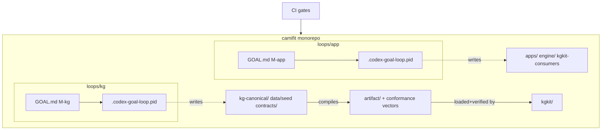

| Concern | Rule (PROPOSED) |
|---|---|
| Write scope, app loop | `apps/`, `engine/`, `kgkit/` (consumes the artifact; never edits `data/seed`) |
| Write scope, kg loop | `kg-canonical/`, `data/seed/`, `contracts/`, regenerates `artifact/` |
| Shared boundary | `contracts/` + `artifact/` are the **only** cross-loop coupling; changes there land via the kg loop and are pulled by the app loop |
| Reviewer gate | each loop keeps its own reviewer `STOP`/`ESCALATE`; the conformance-parity gate (§8.5) is the shared backstop that fails either loop's PR if the boundary drifts |

The `artifact/` directory is the deliberate seam from the two-layer model (§4, §9): the kg loop produces the frozen signed graph + conformance vectors; the app loop's `kgkit/` consumes them and must pass them. Neither loop writes the other's domain, so two executors run concurrently without a shared lock.

### 8.4 History preservation: `git filter-repo`, not subtree merge

Both repos carry reviewer-decision history that justifies current behavior (e.g. camifit commit `9b8b8cc` "CRLF-safe parsing"; fitgraph's 48-test-green KG-logic state). Preserve both. Use `git filter-repo` to rewrite each source repo so its files sit under the target subdirectory **before** merging — this keeps `git log --follow` working across the move, which `git mv` after a naive merge does not. Prefer `filter-repo` over `git subtree add` because subtree squashes (or creates a synthetic merge that breaks `--follow`), and over a fresh `git mv` because that orphans every prior path's history.

```
# fitgraph → kg-canonical/ + data/seed/ (run on a throwaway clone)
git filter-repo --path kg/ --path graph/ --path tests/ --path pyproject.toml \
  --path uv.lock --path docs/kg-module-prd.md \
  --to-subdirectory-filter kg-canonical/
# then split graph/ → data/seed via a path rename pass, commit, add as remote, merge --allow-unrelated-histories
```

CamiFit stays the base repo (it is the hero, §1), so its history is untouched at root; its own files are relocated with `git mv` inside one commit (acceptable because the repo identity is preserved). Tag both repos `pre-monorepo-freeze` first so the original linear histories remain recoverable.

### 8.5 CI gates (all PROPOSED — `.github/workflows/ci.yml`)

Five gates, two of them new. The conformance-parity gate is the load-bearing one for the fixed two-layer decision.

| Gate | Command | Enforces |
|---|---|---|
| `swift-test` | `swift test --disable-sandbox` | engine + app + `kgkit/` unit tests (sandbox off so the test host can read bundled `data/`/`artifact/`) |
| `kg-python` | `uv run pytest` (in `kg-canonical/`) | the canonical KG resolver/safety/alternatives/provenance/member-retrieval tests stay green — the oracle is trustworthy |
| `kg-validation` | `uv run python -m kg.validation` | seed integrity: unique node ids, closed-world edge endpoints, `MAPS_TO.runtime_safety_edge==false`, ontology-lock truthfulness (`verified:false` until pinned) — exits non-zero on failure |
| `artifact-build` | PROPOSED `python -m kg_canonical.compile` | recompiles `artifact/` from `data/seed`; **fails if `artifact/` is dirty vs HEAD** (frozen artifact must be regenerated, not hand-edited) |
| `conformance-parity` | PROPOSED `swift test --filter ConformanceTests` | `kgkit/` (Swift) replays the Python oracle's conformance vectors and must match **byte-for-byte** on every `DecisionReceipt` (decision, `primary_severity`, ordered `reason_codes`, `graph_paths`, `constraint_fingerprint`) |

The `conformance-parity` gate is what makes "port the KG to Swift" safe: it pins the Swift runtime to the Python oracle's output on the golden cases (Jordan's `avoid_loaded_knee_flexion` block on `goblet_squat`, the `no barbell` subset filter, the `exclude deadlifts` VARIANT_OF exclusion). It directly enforces the fixed invariants — deterministic graph traversal decides safety, MAPS_TO is audit-only, vector search never enters the safety path — by failing if any Swift receipt diverges from the deterministic oracle. The honest-broker JSON-RPC posture of the coach (`approvalPolicy:"never"`, `sandbox:"read-only"`, every server→client request answered `-32601`, `CodexAppServerClient.swift`) means the LLM still only verbalizes; CI does not need to police it, only the deterministic KGKit output.

### 8.6 Order of operations

1. **Freeze.** Write `<stop-orchestrator/>` into `fitgraph/GOAL.md`; let its loop halt at the next cycle boundary (clean, not `kill`). Confirm its reviewer last recorded a non-dirty state.
2. **Snapshot.** Tag both repos `pre-monorepo-freeze`; ensure camifit `feat/chat-regimen` is committed.
3. **Rewrite fitgraph history** on a throwaway clone with `git filter-repo` into `kg-canonical/` + `data/seed/`.
4. **Relocate camifit** in-place: `git mv` into `apps/`, `engine/`, `data/golden/`; move `GOAL.md`+`.codex-goal-loop.pid` to `loops/app/`. Keep the live loop pointed at the new root by restarting it against `loops/app`.
5. **Merge** the rewritten fitgraph remote with `--allow-unrelated-histories`; place its `GOAL.md` under `loops/kg/`.
6. **Wire the build:** add `KGKit` target to `Package.swift`; stub `contracts/` and `artifact/` from the first `kg.validation`-clean compile.
7. **Land CI** (`.github/workflows/ci.yml`) with all five gates; require green before either loop resumes.
8. **Restart both loops** against `loops/app` and `loops/kg` with disjoint write scopes; remove `<stop-orchestrator/>` from `loops/kg/GOAL.md` last.

### 8.7 Migration checklist

- [ ] `<stop-orchestrator/>` added to fitgraph `GOAL.md`; loop confirmed idle via its `.codex-goal-loop.pid`
- [ ] camifit `feat/chat-regimen` committed; both repos tagged `pre-monorepo-freeze`
- [ ] `git filter-repo` rewrite of fitgraph into `kg-canonical/`+`data/seed/`; `git log --follow` spot-checked on `kg/safety.py` and a seed file
- [ ] camifit relocated to `apps/`/`engine/`/`data/golden/`; loops moved to `loops/app`,`loops/kg`
- [ ] `--allow-unrelated-histories` merge complete; no path collisions; `uv.lock` and `Package.swift` both resolve
- [ ] `data/seed/*` byte-identical to pre-move fitgraph `graph/*` (verified by hash) — no silent seed drift
- [ ] `uv run python -m kg.validation` green; `uv run pytest` green from `kg-canonical/`; exact test count pinned to the merged fitgraph commit
- [ ] `swift test --disable-sandbox` green (engine + app + KGKit)
- [ ] `artifact/` regenerated by `artifact-build`; tree clean; `conformance-parity` Swift-vs-oracle replay matches on all golden receipts
- [ ] Both loops restarted with disjoint write scopes; per-loop PID files distinct; `<stop-orchestrator/>` removed from `loops/kg/GOAL.md`

Cross-references: artifact/contracts seam (§4, §9); conformance receipts (§5); closed execution loop the app loop builds toward (§6); the contain-vs-surpass framing the kg loop advances (§10); residual risks of two-loop drift (§11).

---

## 9. Ontology provenance and on-device determinism

The take-home demands two things that pull in opposite directions: real ontology grounding (OPE / COPPER / SNOMED CT / SKOS / PROV-O — `ASSESSMENT.md` lines 78–97, ONT-1…8) and a deterministic, graph-only safety decision (`ASSESSMENT.md` lines 9, 69, 116). The fixed two-layer model resolves the tension cleanly: the **Python canonical layer owns ontology semantics** (mapping, the lockfile, the RDF/SHACL production path), and the **Swift serving runtime owns nothing but lexical labels plus the SKOS/PROV metadata it needs to emit a receipt**. Ontology richness lives at build time; the device ships a frozen, deterministic property graph.

### 9.1 What stays in Python vs what crosses into the artifact

| Concern | Owner | Evidence |
|---|---|---|
| Ontology concept catalog (OPE/COPPER/SNOMED) | Python canonical, build-time | `kg-module-prd.md` §10; `graph/ontology-lock.json` |
| `MAPS_TO` LocalTerm→Concept records (SKOS) | Python canonical → frozen as **audit metadata** | `graph/ontology_mappings.seed.json` (confidence `0.0`, `external_id:null`) |
| Lockfile verification + pinning | Python canonical (`validate_ontology_lock`) | `kg/validation.py` |
| RDF/OWL/SHACL `.ttl` export | Python canonical, **never ships** | `kg-module-prd.md` §6, §19 (`optional_export.ttl` unbuilt) |
| Node labels / aliases (resolution) | **Crosses into artifact** | `graph/exercise_kg.seed.json` node `aliases[]` |
| Severity lattice + safety rules | **Crosses into artifact** | `graph/safety_rules.seed.json` |
| Version stamps (graph/ruleset/ontology-lock) | **Crosses into artifact** as freeze coordinates | `kg/validation.py`, `kg/safety.py` |
| PROV-O receipt emission | **Swift runtime, on-device** (PROPOSED port of `kg/provenance.py`) | `kg/provenance.py` |

The compiled artifact carries exactly the slice of ontology metadata the device needs and not one byte more: the labels and synonyms that drive `resolve_text` (today the seed's `aliases` arrays — `Equipment:dumbbell` aliases `["dumbbell","dumbbells","db"]`, `kg/resolver.py:22-29`), and the SKOS predicate + provenance fields needed to *describe* a decision in a receipt. The SNOMED/OPE concept IDs themselves are not needed to *make* a safety decision — the local taxonomy is authoritative (`graph/ontology-lock.json` `runtime_policy`) — so they ride along as audit-only payload, never as traversal edges.

### 9.2 The three determinism invariants, restated for on-device

These are non-negotiable and survive the port verbatim. Each is currently enforced in Python and must be re-enforced in Swift and at compile time.

1. **`MAPS_TO` is audit metadata, never a safety edge.** Enforced today by `validate_graph_seed` (any `MAPS_TO` edge must carry `properties.runtime_safety_edge === false`) and `validate_ontology_mapping_seed` (`maps_to_edges_are_safety_edges` must be `false`) in `kg/validation.py`. The live safety engine never reads `MAPS_TO`: all three reason generators in `kg/safety.py` traverse only `STRESSES`, `PART_OF`, `REQUIRES`, and `VARIANT_OF`. **PROPOSED**: the Swift artifact loader keeps `MAPS_TO` records in a side table (`ontologyMappings`), structurally disjoint from the adjacency index the traversals consult, so it is *impossible* for a closure walk to reach a `MAPS_TO` edge.
2. **Vector search never enforces safety.** There is no embedding code anywhere in `kg/` (the ground-truth grep confirms no `difflib`/cosine/levenshtein imports); the deferred fuzzy/embedding passes are PRD-only (`kg/resolver.py` ships exact/alias only). **PROPOSED on-device rule**: if a fuzzy or embedding resolver is ever added (§9.5), its output is capped at `resolution_status:"needs_review"` / `safety_behavior:"ask_clarification"` and never produces a `hard=True` block or `negated` constraint — exactly the conservative fallback `_unresolved` already uses (`kg/resolver.py:58-67`).
3. **The LLM parses and verbalizes but never decides eligibility.** In CamiFit the coach can *only emit text* — the Codex thread runs `approvalPolicy:"never"`, `sandbox:"read-only"`, and every server→client request is answered with JSON-RPC error `-32601` (`CodexAppServerClient.swift`). The eligibility decision is made by the Swift KG runtime (PROPOSED port) and surfaced as cards through `RegimenBlockParser` (`Sources/CamiFitApp/Regimen/RegimenBlockParser.swift`); the model's role is to phrase the prompt's free text and read back the receipt, exactly the contract drawn in §6/§7.

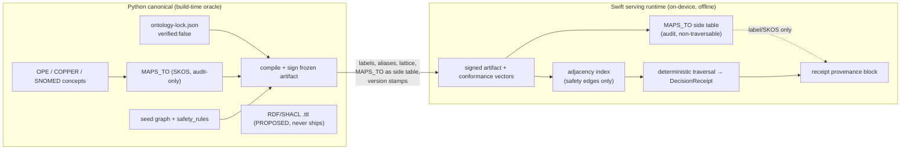

### 9.3 The ontology-lockfile verification process

`graph/ontology-lock.json` is `ontology_lock_version:"ontology-lock-m0-unverified"`, `status:"todo_unverified"`, `verified:false`, with OPE/COPPER/SNOMED_CT each carrying `concept_ids:[]`, `release_id:null`, `license_status:"unverified"`, `accessed_at:null`. The fitgraph constraint is explicit and must be honored: **nothing may claim a verified SNOMED grounding until concept IDs and a release ID are pinned.** This is machine-checked by `validate_ontology_lock` in `kg/validation.py` — `verified=true` *requires* pinned `concept_ids`; status must stay literally `"unverified"` until ids are pinned; license/release/accessed claims require pinned ids. The member injury carries only a `snomedct_hint` string (`member-context.json` `injuries[0]`), which seeds but does not satisfy this.

PROPOSED pinning workflow (build-time only; the device never performs it):

| Step | Gate | Failure mode |
|---|---|---|
| 1. Author candidate concept IDs for the curated SNOMED subset (knee region, left knee joint, patella, patellar tendon, meniscus, lumbar spine, low-back-pain, patellofemoral) per `kg-module-prd.md` §10 | manual review | — |
| 2. Pin `release_id`, `accessed_at`, `license_status` per ontology | `validate_ontology_lock` | claim-without-pin → CI fail |
| 3. Flip `verified:true`, bump `ontology_lock_version` (e.g. `ontology-lock-m1-snomed-v1`) | `verified` requires pinned ids | green |
| 4. Recompile artifact; new `ontology_lock_version` stamps every receipt | conformance vectors | Swift must reproduce Python receipts |

Until step 3 lands, the compiled artifact ships with `verified:false` and the Swift loader **must mark every `MAPS_TO` record non-authoritative** so the runtime can never treat an unverified concept as a safety grounding — a build-time enforcement of the same `runtime_policy` flags. The receipt's `ontology_lock_version` field therefore truthfully reads `ontology-lock-m0-unverified` today; that honesty *is* the feature.

One canonical-source fix to land in the port (PROPOSED): the three version stamps are currently sourced inconsistently — `graph_version` comes from `validation.GRAPH_VERSION` (`"fitgraph-kg-m5-validation-v0"`), which differs from the seed file's own `graph_version` (`"fitgraph-kg-m3-alternatives-v0"`), and `ontology_lock_version` is a hardcoded constant in `kg/safety.py` rather than read from `graph/ontology-lock.json`. The compile step should read all three from the loaded bundle as a single source of truth and bake them into the signed artifact header, so the device cannot drift from the lockfile it was built against.

### 9.4 On-device PROV-O receipts and the UI provenance trace

The Swift runtime emits the exact 10-field `DecisionReceipt` (`provenance_schema.json`; `PROV_RECEIPT_REQUIRED_FIELDS` in `kg/provenance.py`): `exercise_id, decision, primary_severity, reason_codes, primary_reason_code, graph_paths, constraint_fingerprint, graph_version, ruleset_version, ontology_lock_version`. The fingerprint must be a byte-faithful port of `stable_fingerprint` — `sha256(json.dumps(payload, sort_keys=True, separators=(",",":")))[:16]` — so a Swift receipt is identical to the Python oracle's, which is what the CI conformance vectors assert. The realized provenance is the `graph_paths` evidence (canonical `"{source} -PREDICATE-> {target}"` strings) plus the version stamps; the full PROV-O edge materialization (`Decision -GENERATED_BY-> RecommendationRun`, `-USED-> SourceSpan`) is documented but unmaterialized today (`kg/provenance.py`) and is a PROPOSED enrichment.

WG-4 requires every generated plan to ship "why each exercise was chosen, which graph path justified it, what was filtered out for safety" (`ASSESSMENT.md` line 33). The natural surface already exists: `RegimenCard` (`Sources/CamiFitApp/Regimen/RegimenCard.swift`) renders one card per regimen result beneath the coach bubble. **PROPOSED**: a fourth card variant, a *provenance card*, attached to each generated routine, rendering the receipt set:

- **Selected** rows: exercise name + `PASSED_SAFETY` + (when an alternative was substituted) the `AlternativeRecord.graph_paths` shared-`TARGETS`/`HAS_PATTERN` evidence (`kg/alternatives.py`).
- **Filtered** rows: the `primary_reason_code` as a human cue ("Filtered — knee restriction") with the literal `graph_paths` exposed on tap, e.g. `Exercise:goblet_squat -STRESSES-> BodyRegion:left_knee` / `BodyRegion:left_knee -PART_OF-> BodyRegion:knee` / `SafetyRule:avoid_loaded_knee_flexion -USES_CONCEPT-> BodyRegion:knee` — the verbatim closure path from `kg/safety.py` `_medical_reasons`, which is exactly what SAF-3 (sub-structure closure) demands made visible.
- A footer stamping `graph_version / ruleset_version / ontology_lock_version`, so the coach sees the provenance is bound to a specific frozen, signed artifact (and sees `…-unverified` honestly until SNOMED is pinned).

The coach's free text drives this only as input; the LLM never writes a receipt. The card renders the runtime's deterministic output, satisfying PROV-2/PROV-3 and DEL-8's "plan + provenance/filtering trace" without the model ever deciding eligibility.

### 9.5 Where ontology semantics may *expand* on-device — safely

The deferred resolver passes (PRD §11 fuzzy + embedding) are the only place ontology richness could leak into the device. The safe pattern, consistent with the determinism invariants: do the expensive ontology/embedding expansion **at build time** in Python (e.g. Apple `NLEmbedding` or a quantized encoder run during compile to widen the alias set from SKOS synonyms), and ship only the resulting **lexical alias→concept map**. The device then resolves purely by string lookup — fully offline, deterministic, and never invoking a model on a safety path. Any term that still fails to resolve falls to the existing conservative path: a hard `UnresolvedConcept` with `ask_clarification` (`kg/resolver.py:58-67`), because safety is never relaxed for an unrecognized term. This converts ontology grounding from a runtime dependency into frozen build-time evidence — the same move that lets SNOMED grounding be deep *and* the device stay deterministic and offline.

---

## 10. Contain versus surpass ledger

This section is the scorecard. For every capability the assessment grades, it pins the **contain** line (the literal `ASSESSMENT.md` floor — what a passing take-home does), the **surpass** ceiling (what the fused on-device CamiFit product does that no browser dashboard can), and a one-word **status** anchored to real code. The thesis from §1 holds throughout: the assessment's coach dashboard is a *read-only recommendation surface*; CamiFit's surpass is the **closed on-device execution loop** of §6 — the generated plan is run, pose-graded by the deterministic engine (`Sources/CamiFitEngine/EngineTraceRecorder.swift`), and the result is written back into the member KG, all offline. Every surpass below is tied to that loop or to the on-device/offline story; nothing surpasses by adding a bigger LLM.

Status legend: **LIVE** = working code exists in a real file; **PARTIAL** = a seam exists but the surpass is not yet built; **PROPOSED** = net-new design, no code yet.

### The ledger

| Capability | Assessment floor (contain) | CamiFit ceiling (surpass) | Status |
|---|---|---|---|
| **Workout generation** | WG-1/2: free-text prompt + time window → agentic runtime → structured warmup/main/cooldown plan with sets/reps/rest rendered in browser (`ASSESSMENT.md` §A). | The coach chat already round-trips a structured plan: `RegimenBlockParser.parse` (`Sources/CamiFitApp/Regimen/RegimenBlockParser.swift`) decodes a ` ```camifit-routine ` block into `WorkoutRoutine` and renders a `RegimenCard` with a **Start routine** button (`Sources/CamiFitApp/Regimen/RegimenCard.swift`). PROPOSED: the KG safety pass (§5 contract C) runs *before* the plan is emitted, so the generated routine is provably safe-by-construction, not safe-by-prompt. Time-window → volume uses the golden `estimated_rep_duration` field to compute real set counts (PROPOSED, §6). | PARTIAL |
| **Safety-by-traversal** | SAF-1/2/3: filter/down-rank by walking edges — injured joint via `part-of` closure, equipment subset, exclusions, preferences — **deterministically, never a prompt sentence** (`ASSESSMENT.md` lines 9, 69, 116). | Port `kg/safety.py` verbatim to Swift: severity lattice, the three reason generators (medical STRESSES-rule match over PART_OF closure, equipment subset, VARIANT_OF prompt exclusion), `DecisionReceipt` assembly. The same deterministic traversal that filters `goblet_squat` for Jordan's left knee now **runs on the iPhone, offline**. Surpass: the receipt becomes a *gate on the execution loop* — a filtered exercise can never be started, and a selected exercise may execute only through the trackability classification in §5. The assessment filters a list; CamiFit filters what the camera may count. | PROPOSED (port) |
| **Alternatives** | WG-3c: "find equivalent alternatives" when barbell-only exercises drop (`ASSESSMENT.md` line 32). | Port `select_alternatives` (`kg/alternatives.py`): safe-pool-only sourcing, weighted score `round(0.45·target + 0.35·pattern + 0.10·equip + 0.10·priority, 6)` (verified at `alternatives.py:101-108`), deterministic `(-score, id)` tie-break, evidence paths. Surpass: alternatives are drawn from the *already-`selected`* pool, then the CamiFit bridge applies the §5 trackability taxonomy. A safe substitute can become a live routine block only if it is curated, template-generated, or validated; otherwise it remains a visible recommendation/timer block with no second LLM safety pass. | PROPOSED (port) |
| **Concept resolver** | RES-1/2/3/4: 3-pass exact → fuzzy → embedding with confidence thresholds and graceful degradation (`ASSESSMENT.md` line 68). | Honest contain: the **live** `kg/resolver.py` is exact/alias + hardcoded canonical cases + hard `UnresolvedConcept` fallback only — fuzzy and embedding are explicitly Out Of Scope (`docs/briefs/002-m1-resolver-seed-graph.md`). Port that deterministic core to Swift first (status quo parity). Surpass (PROPOSED): implement the deferred fuzzy pass on-device as normalized Damerau-Levenshtein over labels+aliases, gated by a type hint and a best-vs-second margin — **no model, fully offline, deterministic**. Embedding fallback is done at *build time* (Apple `NLEmbedding` expands the alias map; only the resulting lexical alias table ships), so runtime stays purely lexical and the invariant "vector search never enforces safety" is preserved by construction. Unresolved safety-critical terms always degrade to `block_if_safety_critical`, never auto-resolve. | PROPOSED |
| **Coach copilot** | CP-1/3/6: chat with retrieval over member context, quick-prompt palette (`Show me the brief`, `How's adherence trending?`), answers grounded in member data, never invented (`ASSESSMENT.md` §B). | The chat surface exists today: `CodexAppServerClient` streams turns; `ChatViewModel` (`Sources/CamiFitApp/ContentView.swift`) renders bubbles. Surpass (PROPOSED, detailed in §7): replace the single embedded few-shot template (`CodexAppServerClient.baseInstructions`) with KG-grounded fact-card injection — port `kg/member_retrieval.py`'s seven deterministic queries to Swift, each returning `{claim, confidence:"deterministic", source_nodes[]}`. The LLM *verbalizes* fact cards; it never queries the graph or decides safety. The hard guardrail: if no fact card, the coach says "the graph has no supporting fact," exactly as the fitgraph contract requires. | PARTIAL |
| **Charts** | CP-4: `Plot adherence trend`, `Show message pattern`, `Compare last 4 weeks` (`ASSESSMENT.md` line 42). | Contain: render the 4-week adherence series and 7-day sleep array from the member KG. Surpass (PROPOSED): the charts plot **both** the historical member-context data *and* live session telemetry the loop produces — actual reps, form score, and cue history from `AppExerciseSessionViewModel.state`/`AppHUDState` (`Sources/CamiFitApp/AppHUDState.swift`). The assessment charts what a coach logged; CamiFit charts what the camera measured this morning. | PROPOSED |
| **Provenance** | PROV-1/2/3: PROV-O receipt per plan — why chosen, which graph path, what was filtered (`ASSESSMENT.md` lines 33, 56). | Port the realized provenance layer (`kg/provenance.py`): `stable_fingerprint` (sha256[:16], sorted-key JSON), `validate_decision_receipt`, the 10 required fields, version stamps. Surpass (PROPOSED): the receipt is also stamped with the **frozen-artifact hash** of the on-device graph bundle (§9), so a receipt proves *which exact signed graph* made the call — provenance that survives offline and is independently verifiable. PROPOSED: materialize the `Decision -GENERATED_BY-> RecommendationRun` PROV edges as real records so a decision can return a provenance subgraph, not a flat path list. | PROPOSED (port) |
| **Longitudinal reasoning** | NTH-7: progression/adherence over time (a *nice-to-have*, `ASSESSMENT.md` line 135). | Port `adherence_trend`/`sleep_this_week` fact cards (`kg/member_retrieval.py`) — declined/improved/flat over the 4-week series. Surpass (PROPOSED, the heart of §6): the execution loop **writes new longitudinal data**. A completed routine emits a new `WorkoutSession`/`ExercisePerformance` node (PRD §7 declared-but-unseeded type) into the member KG with measured reps, form score, and `STRESSES`-evidence from the run. Next session's safety pass and adherence card read the member's *actual on-device history*. The dashboard reasons over a static fixture; CamiFit grows the fixture. | PROPOSED |
| **Multi-member** | Single golden member Jordan Rivera; the spec never asks for more (`ASSESSMENT.md`, one `member-context.json`). | The exercise graph is shared and immutable; each member gets their own small member-KG snapshot. On-device, the member KG is *the device owner's*, written by their own loop — privacy-preserving by topology. The exercise/safety artifact is shipped once and frozen (§9); member graphs never leave the device. | PROPOSED |
| **On-device execution** | **Not in scope at all.** The assessment has no camera, no rep counting, no form grading — it is a recommendation dashboard (`ASSESSMENT.md` entire). | The entire `Sources/CamiFitEngine` pipeline: pose → signal DSL → filter → validity → rep FSM / hold accumulator → form rules → cue/score, all timestamp-driven and offline (`EngineTraceRecorder.swift`). A `camifit-exercise` block is decode + **dry-run validated** against a real `PoseFrame` (`RegimenBlockParser.validate`) before it can be saved. This is the moat: the KG-generated plan *is executed and graded*, closing the loop no browser app can. | LIVE (engine) / PARTIAL (loop closure) |
| **Offline / privacy** | The assessment runtime assumes server-side LLM + vector store; `PERF-1` targets ~5s responses (`ASSESSMENT.md` line 123). | Safety, resolution, alternatives, and fact cards all run as deterministic Swift traversal over a frozen local graph — **zero network for any safety decision**. The Codex coach is the only network dependency and it *only verbalizes*; `thread/start` runs `sandbox:"read-only"`, every server→client request is refused with `-32601` (`Sources/CamiFitApp/CodexAppServerClient.swift`), so the LLM provably cannot decide eligibility or exfiltrate the member graph. Member KG never leaves the device. | PARTIAL (KG port pending) |
| **Exercise scale** | 50-exercise golden catalog, 19 muscle groups / 9 joints / 36 patterns / 32 equipment, all `priority_tier:2` (`data/exercises.json`). | Contain: the conformance importer compiles all 50 with exact-count CI gates (§9). Surpass (PROPOSED): every catalog exercise gets an explicit execution classification (`trackable_curated`, `trackable_template`, `trackable_generated`, `timer_or_manual`, `recommendation_only`, or `filtered`). The catalog stops being just a list and becomes a staged execution library: some exercises are pose-graded, some are timer/manual, and some remain recommendation-only until authored. Build-time STRESSES enrichment (deterministic `pattern × joint` curation table) supplies the safety bundle the golden `joints_loaded[]` lacks. | PARTIAL |
| **Ontology depth** | ONT-1–8: ground in OPE/COPPER/SNOMED/SKOS/PROV-O; "small, well-justified subset beats wiring everything shallowly" (`ASSESSMENT.md` line 80). | Contain honestly: `ontology-lock.json` ships `status:"todo_unverified"`, `verified:false`, no pinned concept IDs — MAPS_TO is **audit metadata only**, forbidden from safety traversal (`graph/ontology_mappings.seed.json`). Surpass (PROPOSED): pin the tiny SNOMED subset (knee region, patella, patellar tendon, meniscus, lumbar spine, patellofemoral) the `snomedct_hint` seeds, at *build time* in the Python canonical layer. The frozen artifact compiles with MAPS_TO marked non-authoritative, so the on-device Swift runtime *cannot* treat an unverified concept as a safety grounding even if pinning is incomplete. The invariant survives the port mechanically. | PROPOSED |

### The contain/surpass topology

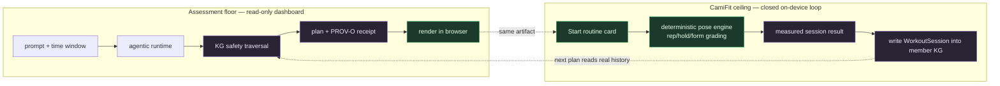

The loop-back arrow (`B4 → A3`) is the whole surpass: the assessment's pipeline terminates at "render," CamiFit's continues into "run, grade, write back, re-plan." Everything left of the dashed line is what a take-home delivers; everything right is impossible without the on-device engine.

### Ranked surpass bets

These are the bets ranked by **moat-per-unit-effort** — defensibility against a generic dashboard divided by build cost, given that the safety/resolver/alternatives logic is a mechanical port of already-tested Python behavior pinned by conformance vectors.

1. **Close the execution loop (write-back).** The single highest-leverage bet, and the only one no competitor can copy without an on-device grading engine. The engine is LIVE (`EngineTraceRecorder.swift`); the routine runtime is LIVE-but-manual (`advanceRoutine`, `AppExerciseSessionViewModel.swift:101`). The gap is: emit a `WorkoutSession`/`ExercisePerformance` node from a completed set and feed it back into the member KG. This turns a static fixture into a growing personal graph and makes every subsequent plan grounded in measured reality, not chat text. **Build cost: medium. Moat: maximal.**

2. **Port `kg/safety.py` + `kg/alternatives.py` + `kg/provenance.py` to Swift behind a conformance harness.** This *is* the §4 two-layer model: the Python oracle emits conformance vectors, the Swift port must pass them in CI. It delivers SAF-1/2/3, WG-3a/b/c, and PROV-1/2/3 simultaneously, on-device and offline, and gates the execution loop (bet 1) so unsafe exercises are never runnable. Low risk because behavior is pinned by golden tests. **Build cost: medium. Moat: high (offline determinism).**

3. **KG-grounded fact-card copilot replacing the embedded few-shot.** Port `kg/member_retrieval.py`'s seven queries; inject fact cards into `CodexAppServerClient.baseInstructions`; enforce "no card → no claim." This converts CP-6 from "the model promises not to hallucinate" into a structural guarantee, and the `sandbox:"read-only"` + `-32601` posture already proves the LLM can't decide safety. **Build cost: low (seam exists at the `chat.codex` boundary). Moat: medium.**

4. **Frozen, signed, content-hashed graph artifact stamped into every receipt.** The §9 freeze: hash the merged graph + ruleset + ontology-lock into one artifact version the Swift runtime verifies at load and stamps on every `DecisionReceipt`. This makes offline provenance independently verifiable and resolves the live version-stamp mismatch (`validation.GRAPH_VERSION` vs the seed's own field). **Build cost: low. Moat: medium (auditability).**

5. **Build-time SNOMED pinning + on-device lexical fuzzy resolver.** Pin the tiny SNOMED subset and expand the alias map via `NLEmbedding` *at build time*, shipping only a lexical table so runtime stays deterministic and offline. Closes the RES-2 fuzzy gap and the ONT-4 depth gap without ever letting vectors touch a safety decision. **Build cost: medium. Moat: lower (incremental), but it converts two honest "PROPOSED/placeholder" rows into real grounding.**

The throughline: CamiFit contains the assessment by *porting* its proven deterministic core, and surpasses it by *running the output* — every surpass bet either closes the execution loop or makes that loop trustworthy offline.

---

## 11. Risks open questions and phased roadmap

This section names the load-bearing risks and open questions for the fusion, then lays out a six-phase roadmap with explicit entry/exit criteria and the conformance gate each phase must clear. It assumes the fixed decisions from §1 and the contracts from §5, the two-layer KG from §4, the execution loop from §6, and the contain/surpass ledger from §10.

### 11.1 Risks and open questions

| # | Risk / open question | Why it bites | Grounding | Disposition |
|---|---|---|---|---|
| R1 | **Porting Python determinism to Swift without drift.** The Python runtime guarantees order-independence only by *explicit* sorts (`_exact_label_or_alias_match` sorts nodes by id, `part_of_closure_paths`/`part_of_path` sort by source/target, `evaluate_candidates` sorts by id, alternatives tie-break `(-score, id)`, fingerprint uses `sort_keys=True`, scores `round(...,6)`). Swift `Dictionary`/`Set` iteration order differs from CPython's and from run to run. | Any unsorted traversal that feeds output silently diverges from the oracle. | `/Users/kelly/Developer/fitgraph/kg/graph_store.py`, `kg/safety.py`, `kg/alternatives.py`, `kg/provenance.py` | **Contain.** Conformance vectors (§5) are the only acceptable proof. PROPOSED: a Swift `StableFingerprint` that reproduces `sha256(json.dumps(payload, sort_keys=True, separators=(",",":")))[:16]` byte-for-byte, tested against Python-emitted vectors in CI. |
| R2 | **Float and fingerprint parity across languages.** `round(0.45·a+0.35·b+0.10·c+0.10·d, 6)` and the sha256-of-canonical-JSON fingerprint must match Swift exactly, including JSON number formatting (`0.4275` not `0.42750000001`). | A single ULP or `,`/`:` separator difference breaks every receipt's `constraint_fingerprint`. | `kg/alternatives.py` `_weighted_score`, `kg/provenance.py` `stable_fingerprint` | **Contain.** PROPOSED: canonicalize to integer-scaled fixed-point before hashing, or pin a shared JSON canonicalizer; assert against frozen vectors. |
| R3 | **Compiling 50 catalog exercises into *runnable* Exercise-Programs.** The catalog gives `joints_loaded[]`/`muscle_groups[]`/`movement_patterns[]` — it carries **no** pose signals, predicates, or form rules. The engine only runs `abs/angle/angle_to_vertical` and a single-comparison predicate grammar; `bodyweight_plank` is the only hold preset. | A KG-selected exercise that has no pose program cannot enter the execution loop (§6) — it can be *recommended* but not *graded*. | catalog `/Users/kelly/Developer/camifit/docs/requirements/candidate-assessment/data/exercises.json`; engine grammar `/Users/kelly/Developer/camifit/Sources/CamiFitEngine/Expression/{Lexer,Parser,Evaluator}.swift`; presets `/Users/kelly/Developer/camifit/Presets/` | **Phased.** Only the 4 v1 presets are runnable today. PROPOSED: a per-movement-pattern authoring table (squat/lunge/press/hold archetypes) so a subset of the 50 compile to real programs; the rest recommend-only until authored. This is the single biggest scope unknown. |
| R4 | **Embedding fallback on-device.** PRD §11 wants exact→fuzzy→embedding; the live resolver implements **only** exact/alias + hardcoded cases (`kg/resolver.py`), and fuzzy/embedding are explicitly Out Of Scope (`docs/briefs/002-m1-resolver-seed-graph.md`). | Shipping an embedding pass risks letting a vector match influence safety — forbidden. | `kg/resolver.py`, `docs/briefs/002` | **Surpass, fenced.** Embedding work happens at **build time** only (expand alias map via Apple `NLEmbedding`); runtime stays purely lexical; any embedding-derived term is capped at `needs_review`, never auto-resolving a safety-critical concept. Invariant: vector search never enforces safety. |
| R5 | **SNOMED licensing / ontology verification.** `ontology-lock.json` is `verified:false`, all `concept_ids:[]`, `external_id:null`, `confidence:0.0`; MAPS_TO is audit-only. | Claiming verified grounding without pinned IDs/release/license violates the lock's own truthfulness checks (`kg/validation.py validate_ontology_lock`). | `/Users/kelly/Developer/fitgraph/graph/ontology-lock.json`, `graph/ontology_mappings.seed.json`, `kg/validation.py` | **Contain now, surpass later.** Phase 5 only. Until pinned, the compiled artifact ships MAPS_TO marked non-authoritative; lock stays literally `"unverified"`. |
| R6 | **Dual-loop coordination.** Two autonomous loops (§8): the *recommendation* loop (resolve→safety→alternatives→receipt) and the *execution* loop (pose→grade→observation write-back). They share the member KG but have different determinism profiles (graph traversal is pure; pose grading is timestamp/sensor-driven). | Write-back from a noisy live session could corrupt the deterministic member graph the safety engine reads. | recommendation: `kg/safety.py`; execution: `/Users/kelly/Developer/camifit/Sources/CamiFitEngine/EngineTraceRecorder.swift`, member graph `/Users/kelly/Developer/fitgraph/graph/member_kg.seed.json` | **Phased.** PROPOSED: observations write to a separate append-only `ExercisePerformance`/`WorkoutSession` partition (declared-but-unseeded in PRD §7) consumed by fact cards; they never mutate STRESSES/PART_OF safety edges. |
| R7 | **Member-vs-coach framing.** Assessment specifies a *coach* dashboard (CP-2 morning brief, CP-7 churn); the hero product is *member-facing* (§1). | A first-person member app surfacing "churn risk: elevated" or "celebrate Jordan" reads wrong. | `docs/requirements/candidate-assessment/ASSESSMENT.md` (CP-2/CP-7); chat surface `/Users/kelly/Developer/camifit/Sources/CamiFitApp/ContentView.swift` | **Contain by reframing (§7).** Same fact cards, re-voiced: churn→"let's get you back on track," celebrate→self-congratulation. The graph queries are identical; only the verbalization layer changes. |
| R8 | **~5s latency / on-device perf.** Soft target ≤5s (ASSESSMENT line 123); Python traversal is O(edges) linear scan per query (`kg/graph_store.py outgoing/incoming`). | At 50 exercises × N constraints, repeated linear scans plus per-frame pose eval on iPhone could miss budget. | `kg/graph_store.py`; pipeline `/Users/kelly/Developer/camifit/Sources/CamiFitEngine/FrameSignalProcessor.swift` | **Surpass.** PROPOSED: Swift loader precomputes adjacency dicts `[nodeId:[predicate:[edge]]]` + materialized PART_OF closures → O(1)/O(depth). Pose eval is already per-frame and offline. |
| R9 | **Two divergent DSL surfaces.** Loader regex allowlist (10 functions, and/or/not) is a superset of the runtime (3 functions, single comparison); `form_rules.when` isn't validated at load. | A KG-emitted program can *load* yet evaluate `.invalid` at runtime — the candidate→Program compile (§5) would emit plausible-but-dead programs. | `/Users/kelly/Developer/camifit/Sources/CamiFitEngine/ProgramLoader.swift` vs `Expression/Parser.swift`; `FormRuleEvaluator.swift:479-549` | **Contain.** Generator targets the **intersection** only; PROPOSED Phase 2 hardening: make `ProgramLoader` fully parse expressions + `FormRuleCondition` at load so "reject at load" is restored. |
| R10 | **Version-stamp triple mismatch.** `graph_version` comes from `validation.GRAPH_VERSION` ("…m5…"), differs from the seed file's own field ("…m3…"); `ontology_lock_version` is a hardcoded constant in `safety.py`. | The frozen artifact needs one canonical freeze coordinate, not three. | `kg/validation.py`, `kg/safety.py`, `graph/exercise_kg.seed.json` | **Contain at compile.** PROPOSED: the artifact compiler emits a single content-hash freeze; all three fields read from the loaded bundle. |

### 11.2 Phased roadmap

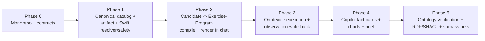

| Phase | Entry criteria | Exit criteria | Conformance gate |
|---|---|---|---|
| **P0 — Monorepo + contracts** | Three repos exist independently (camifit, fitgraph). | Single monorepo: Swift app + Python canonical `kg/` + shared `contracts/` dir holding the JSON schemas for `ResolvedConstraint`, `DecisionReceipt`, `AlternativeRecord`, `FactCard`, `ExerciseProgram`, and the trackability classification (PROPOSED, derived from `kg/constraints.py`, `kg/safety.py`, `ExerciseProgram.swift`, and §5). CI runs both the pinned KG oracle tests and the Swift engine tests. Frozen-vector format defined. CamiFit may add fixture JSON responses against these contracts so UI/model work can proceed before the Swift runtime lands. | **Structural only:** both test suites green in one CI; fixture responses validate against contracts; no behavior change. |
| **P1 — Canonical catalog + compiled artifact + Swift resolver/safety with parity** | P0 done; contracts frozen. | Python canonical layer imports all 50 exercises (`source id`→`source_exercise_id`, `joints_loaded`→STRESSES, `muscle_groups`→TARGETS, `movement_patterns`→HAS_PATTERN, `equipment_required`→REQUIRES) + full Jordan, emits a **frozen signed graph artifact** + conformance vectors. Swift loads the artifact and a Swift port of `resolve_text` + `evaluate_candidates` + `select_alternatives` passes every vector byte-for-byte (fingerprints, `graph_paths`, lattice precedence, alternatives tie-break). STRESSES curation table authored (the hand-tuned safety bundle has no upstream source). | **Conformance importer count gate** (synthesis plan §"Conformance importer"): exactly 50 exercises / 19 muscle groups / 9 joints / 36 movement patterns / 32 equipment + full Jordan; **fail CI on any silently dropped field**. **Parity gate:** Swift output ≡ Python oracle on all vectors. **Safety gate:** `unsafe_allowed_rate = 0` on the WG-3a/b/c golden cases. |
| **P2 — Candidate → Exercise-Program compile + render in chat** | P1 parity holds; Swift safety engine selects a safe pool on-device. | A KG-backed generator emits `camifit-routine` blocks referencing only known-good preset ids, and `camifit-exercise` blocks for the authored archetypes, into the existing chat surface (`RegimenBlockParser`, `RegimenCard`). Every emitted program targets the DSL **intersection** (R9) and survives `ProgramLoader.load` + dry-run. `ProgramLoader` hardened to fully parse expressions + `form_rules.when` at load. | **Compile gate:** 100% of generator-emitted programs pass load + dry-run (no load-accepts-but-runtime-invalid). **Provenance gate:** every routine block carries the `DecisionReceipt` graph-path trace (WG-4/PROV-2). No dangling preset ids. |
| **P3 — On-device execution + observation write-back** | P2 emits runnable programs; live/synthetic pose path works (`LiveSession`, `EngineTraceRecorder`). | Member runs a generated workout; the engine grades reps/holds/form and writes results into an **append-only `WorkoutSession`/`ExercisePerformance` partition** of the member KG (PROPOSED; PRD §7 declared-unseeded). Fact cards read the write-back; safety edges are never mutated (R6). Guided-workout auto-advance on set completion wired to `advanceRoutine`. | **Loop closure gate:** a recommended→graded→written-back round trip is reproducible end-to-end. **Isolation gate:** post-write-back, re-running safety on the member graph yields identical receipts (write-back touched no safety edge). |
| **P4 — Copilot fact cards + charts + brief** | P3 write-back live; member KG enriched with real session data. | The seven deterministic fact-card queries (`kg/member_retrieval.py`: adherence_trend, sleep_this_week, churn_risk, coach_brief, etc.) ported to Swift and surfaced in chat with the member-voiced reframing (R7). Quick-prompt palette (CP-3) + charts (CP-4: adherence trend, last-4-weeks) render from fact-card `source_nodes`. Every number traces to a node via DERIVED_FROM. | **Grounding gate (CP-6):** every surfaced number exactly equals its graph query; absent data returns "the graph has no supporting fact." LLM summarizes fact cards only — it never invents or decides eligibility. |
| **P5 — Ontology verification + RDF/SHACL + surpass bets** | P1–P4 stable; demand for real ontology grounding. | SNOMED/OPE/COPPER concept IDs pinned in `ontology-lock.json` (`verified:true`, populated `concept_ids`, release/license/`accessed_at`); MAPS_TO promoted from audit-only with real `external_id`/`confidence`. PRD §20 integrity checks (no PART_OF cycles, Exercise completeness, REQUIRES→Equipment, STRESSES→BodyRegion) run in CI. Surpass bets land: build-time embedding alias expansion (R4), transitive VARIANT_OF closure, materialized PROV-O edges, missing DSL functions (`distance/ratio/midpoint`) enabling stance-width / valgus-proxy form rules. | **Truthfulness gate:** `validate_ontology_lock` passes only with pinned IDs; no license/release claim without pinned IDs. **Invariant gate:** MAPS_TO never appears in a safety/closure path; vector search never enforces safety; embedding output capped at `needs_review`. |

### 11.3 Immediate next targets

**Phase 0 and Phase 1 are the two writing-plans targets.** P0 is pure plumbing (monorepo topology, the shared `contracts/` schemas, dual-suite CI, frozen-vector format, and CamiFit fixture responses) and de-risks everything downstream by establishing the oracle harness without pretending the Swift runtime already exists. P1 is where the thesis is proven or falsified: it is the first phase that produces the **frozen signed graph artifact** and demonstrates **Swift-runtime parity against the Python oracle's conformance vectors** while hitting the importer count gate and `unsafe_allowed_rate = 0` on the golden injury/equipment cases (§3, §6). Everything after — chat-side generation (§7), the closed execution loop (§6), ontology verification (§9) — depends on P1's parity proof holding. Plan P0 and P1 in full detail next; leave P2–P5 as roadmap until P1's parity gate is green.
