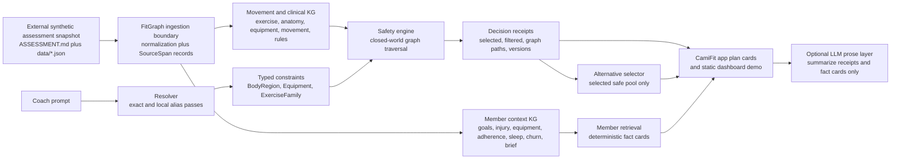

# FitGraph KG Candidate Assessment

FitGraph is a deterministic knowledge-graph layer for a coach-facing workout
and member-context assessment. It is built around one rule: the language model
may parse coach language or summarize bounded facts, but local typed graph
traversal decides workout eligibility, injury safety, equipment filtering,
alternatives, decision receipts, and Coach Copilot fact cards.

The imported assessment snapshot lives under
`../data/golden/candidate-assessment/` and is treated as read-only source input.
Its synthetic fixtures define the target product surface: a Workout Generator
and a Coach AI Copilot for Jordan Rivera. This repo provides the runnable
deterministic KG package, generated assessment-conformance graph artifacts,
API-shaped Python contracts, CamiFit app integration artifacts, and a static
coach dashboard demo. No live LLM service is required for local operation.

## Architecture



The runtime graph is deliberately closed-world: local `graph/*.seed.json`
artifacts are the behavior source of truth. `MAPS_TO` and SKOS-style ontology
mappings are preserved as audit metadata, not as safety edges. The ontology
lockfile is explicitly unverified, so the README does not claim pinned SNOMED,
OPE, COPPER, release, access-date, or license values.

## Ontology And Provenance

Current runtime safety uses only local curated graph predicates such as
`PART_OF`, `STRESSES`, `REQUIRES`, `VARIANT_OF`, and generated source-span
provenance. `MAPS_TO` is audit metadata only; it is not a traversal edge for
safety decisions and must not relax medical, equipment, or prompt exclusions.

Ontology status is intentionally scoped:

- **OPE** remains a future exercise-ontology alignment target. Current local
  exercise-family and movement-pattern nodes are deterministic CamiFit/FitGraph
  concepts, not verified OPE identifiers.
- **COPPER** remains a future coaching/programming vocabulary target. Current
  workout prescriptions and alternatives use local typed dataclasses, not
  verified COPPER terms.
- **SNOMED CT** remains deferred for clinical concept identifiers. The graph can
  represent `BodyRegion` and injury constraints, but no SNOMED concept ID,
  release, access date, or license status is claimed as verified.
- **SKOS** is represented only by local label/alias/mapping shape today. A
  production graph should export reviewed concepts as SKOS with pinned releases.
- **PROV-O** is approximated through `SourceSpan`, source hashes, graph version
  stamps, decision receipts, and generated artifact metadata. A production graph
  should emit formal PROV-O/RDF artifacts.
- **RDF/SHACL** are production-path validation formats, not current runtime
  dependencies. The local JSON graph stays the assessment submission runtime
  until a verified ontology lock and SHACL validation lane is completed.

## Stack Choices

- Python 3.10+ with no runtime dependencies keeps the reasoning layer small,
  inspectable, and easy to run inside a one-day assessment window.
- Local JSON graph seeds make the graph diffable in review and easy to validate
  without an external graph database.
- Typed dataclasses in `kg/` model constraints, graph nodes, graph edges,
  decision receipts, alternatives, and fact cards.
- Deterministic traversal in `kg.safety` enforces medical, equipment, and prompt
  exclusions; vector search and LLM calls are intentionally absent from safety.
- `kg.validation` provides a local health command for seed-file presence,
  schema checks, ontology-lock truthfulness, and audit-only `MAPS_TO` policy.
- `pytest` is the regression suite for resolver behavior, safety filtering,
  alternatives, provenance, member retrieval, graph loading, and workflow guardrails.

This stack favors auditability and fast local review over infrastructure
realism. A production version should project the same curated graph into a
serving store, add RDF/SKOS/PROV-O/SHACL artifacts, and expose the contracts over
HTTP or a package boundary used by the dashboard.

## How To Run Locally

Install/sync dev dependencies:

```bash
uv sync --dev
```

Run the test suite:

```bash
uv run python -m pytest
```

Run the graph health and ontology-sidecar validation command:

```bash
uv run python -m kg.validation
```

Import the frozen assessment fixtures into generated graph artifacts:

```bash
uv run python -m kg.assessment_import
```

Generate a graph-backed workout payload:

```bash
uv run python -m kg.workout_generator \
  --member Member:jordan \
  --prompt "Build a 50-minute lower-body session. Exclude deadlifts. Only DB and KB." \
  --minutes 50
```

Answer a graph-backed Copilot quick prompt:

```bash
uv run python -m kg.copilot --member Member:jordan --question "Sleep this week"
```

Run the static dashboard demo:

```bash
python3 -m http.server 4173 --directory dashboard
```

Then open `http://127.0.0.1:4173/`.

One-command local smoke check:

```bash
uv run python -m pytest && uv run python -m kg.validation && uv run python -m kg.assessment_import
```

Minimal interactive example:

```bash
uv run python - <<'PY'
from dataclasses import asdict
from kg.resolver import resolve_text
from kg.safety import evaluate_candidates

constraints = resolve_text(
    "Build a 50-minute lower-body session. Exclude deadlifts. Only DB and KB."
)
available = {
    f"Equipment:{item.value}"
    for item in constraints
    if item.constraint_type == "Equipment"
    and item.hard
    and item.safety_behavior == "allowed_equipment_only"
}
receipts = evaluate_candidates(
    [
        "Exercise:barbell_back_squat",
        "Exercise:goblet_squat",
        "Exercise:kettlebell_deadlift",
        "Exercise:glute_bridge",
        "Exercise:jump_squat",
    ],
    available_equipment=available,
    constraints=constraints,
)
for receipt in receipts:
    print(asdict(receipt))
PY
```

## Assessment Coverage

Implemented in the current repo:

- Local movement/clinical KG seed with exercises, body regions, movement
  patterns, equipment, exercise family, and safety rules.
- Local member-context KG seed for Jordan with goal, available equipment, active
  left-knee injury, adherence observations, sleep biomarker observation, churn
  signal, coach brief, and source spans.
- Resolver cases for `knee`, `left knee`, `bad lower back`, `kettlebell`,
  `no barbell`, `only dumbbells and kettlebell`, `exclude deadlifts`, and `pecs`.
- Safety receipts for active knee restrictions, lower-back restrictions,
  missing/disallowed equipment, prompt family exclusions, secondary reasons, and
  selected candidates.
- Alternatives selected only from exercises already marked safe in the same
  safety result set.
- Coach Copilot fact cards for equipment, injury, goals, adherence trend, sleep
  this week, churn risk, coach brief, and no-supporting-fact behavior.
- Generated assessment-conformance import artifacts for all 50 exercises, 19
  muscle groups, 9 loaded body regions, 36 movement patterns, 32 equipment
  terms, and Jordan's full synthetic member context.
- CLI contracts for `kg.workout_generator` and `kg.copilot`.
- Static dashboard under `dashboard/` with member context, workout generator,
  provenance trace, alternatives, Copilot quick prompts, charts, and evidence.
- CamiFit app assignment artifacts consumed by Swift KGKit for the current
  release closeout path: 50-exercise workout recommendation coverage, app plan
  cards, and graph-backed Copilot fact cards.
- Audit checks that prevent `MAPS_TO` from becoming a safety edge and prevent
  verified ontology claims without pinned lockfile values.

Pending production integration:

- Swap the static dashboard fixture to live HTTP endpoints if a service boundary
  is needed.
- Decide whether the generated 50-exercise graph should become the default
  developer seed. The Swift assignment-mode artifact already exists for the app
  closeout path; the smaller hand-curated seed remains useful as a compact
  developer fixture.
- Add a live agent workflow or LLM prose layer if desired. The safe boundary is
  defined, but no external model integration is active in this repo.

## AI Usage

AI was used as a development collaborator for architecture synthesis,
implementation planning, code drafting, review, and README shaping. Runtime
behavior does not depend on a live LLM. The repository currently uses local
deterministic code paths for safety and fact retrieval; any future LLM layer
should receive only resolved constraints, decision receipts, and fact cards, and
should not invent eligibility decisions or member facts.

No external accounts, paid resources, live ontology downloads, real member data,
or PHI were used. The imported data is synthetic assessment data.

## Trade-Offs And Decisions

- The default runtime seed is hand-curated and small. That makes the safety
  proof easy to audit; the generated assessment artifacts cover the full
  external fixture as a conformance baseline.
- The runtime uses a local property graph instead of a graph database or RDF
  engine. That keeps local execution friction low while preserving a production
  migration path through SKOS, PROV-O, SHACL, and a versioned ontology lockfile.
- Exact and local-alias resolution are emphasized. Fuzzy and embedding fallback
  are production candidates, but they should never relax safety-critical
  failures.
- `MAPS_TO` is audit metadata only. Local `PART_OF`, `STRESSES`, `REQUIRES`,
  `VARIANT_OF`, and safety-rule edges are the runtime decision edges.
- Alternatives are chosen from the already-safe pool. This may produce fewer
  suggestions in a small seed graph, but it avoids recommending an unsafe
  substitute.
- Member dislikes are treated as soft constraints unless explicitly configured
  as hard blocks. Medical and equipment constraints remain hard.

## Production Evaluation Plan

- Resolver quality: exact, alias, fuzzy, and embedding fallback precision and
  recall by expected concept type, with safety-critical unresolved terms tracked
  separately.
- Safety correctness: golden conformance cases for injury closure, equipment
  subset checks, family exclusions, unresolved safety behavior, and alternatives
  from safe candidates only.
- Provenance completeness: every selected, filtered, downranked, unresolved, or
  alternative decision has graph paths, reason codes, graph version, ruleset
  version, ontology-lock version, and source spans where relevant.
- Copilot groundedness: every member answer is traceable to fact cards; absent
  data returns a no-supporting-fact card instead of invented prose.
- Human review metrics: coach acceptance rate, override reasons, unsafe-near-miss
  reports, and time saved creating workout plans.
- Runtime metrics: resolver latency, graph traversal latency, receipt generation
  latency, LLM latency if added, and error rates by query class.
- Data and ontology drift: CI should validate lockfile versions, schema
  migrations, changed safety rules, changed mappings, and fixture conformance
  before deployment.
- Monitoring: sample generated plans for safety violations, unsupported claims,
  missing provenance, overly broad filtering, and low-quality alternatives.

## Limitations

- `graph/ontology-lock.json` is `verified: false`; ontology concept IDs,
  releases, access dates, and license status are not pinned.
- The default runtime seed is intentionally compact; full fixture import exists
  under `graph/generated/` and through `kg.assessment_import`.
- The dashboard is a static contract-shaped demo, not a production app with auth,
  persistence, or live service calls.
- There is no live LLM, vector store, external ontology service, production auth,
  or persistent database integration.
- The Python workout command returns structured workout sections from graph
  receipts, but prescription progression remains intentionally simple.
- Synthetic Jordan data is represented as local source-backed graph facts; it is
  not real member data.

## Example Prompts And Provenance-Oriented Outputs

### 1. Limited equipment plus deadlift exclusion

Prompt:

```text
Build a 50-minute lower-body session. Exclude deadlifts. Only DB and KB.
```

Resolved constraints:

- `ExerciseFamily:deadlift_family`, hard negated, from `Exclude deadlifts.`
- `Equipment:dumbbell`, hard allowed-equipment-only, from `Only DB and KB.`
- `Equipment:kettlebell`, hard allowed-equipment-only, from `Only DB and KB.`

Generated candidate output:

- Selected: `Exercise:goblet_squat` with `PASSED_SAFETY`.
- Filtered: `Exercise:barbell_back_squat` because
  `MISSING_EQUIPMENT:barbell`.
- Filtered: `Exercise:kettlebell_deadlift` because
  `PROMPT_EXCLUDED_FAMILY:deadlift_family`.
- Filtered: `Exercise:glute_bridge` and `Exercise:jump_squat` because the
  prompt allowed only dumbbell and kettlebell equipment, while both require
  `Equipment:yoga_mat`.

Provenance trace excerpt:

```text
Exercise:barbell_back_squat -REQUIRES-> Equipment:barbell
Exercise:kettlebell_deadlift -VARIANT_OF-> ExerciseFamily:deadlift_family
Exercise:goblet_squat -REQUIRES-> Equipment:kettlebell
```

Alternative trace excerpt:

```text
Exercise:barbell_back_squat -> Exercise:goblet_squat, score 0.97
Exercise:barbell_back_squat -HAS_PATTERN-> MovementPattern:squat
Exercise:goblet_squat -HAS_PATTERN-> MovementPattern:squat
Exercise:goblet_squat -REQUIRES-> Equipment:kettlebell
```

### 2. Injury case

Prompt:

```text
Jordan has an active knee restriction. Exclude deadlifts.
```

Generated candidate output using Jordan's current seed equipment
(`kettlebell`, `yoga_mat`):

- Selected: `Exercise:glute_bridge` with `PASSED_SAFETY`.
- Filtered: `Exercise:goblet_squat` because `ACTIVE_KNEE_RESTRICTION`.
- Filtered: `Exercise:jump_squat` because
  `ACTIVE_KNEE_HIGH_IMPACT_RESTRICTION`.
- Filtered: `Exercise:kettlebell_deadlift` because
  `PROMPT_EXCLUDED_FAMILY:deadlift_family`.
- Filtered: `Exercise:barbell_bench_press` because
  `MISSING_EQUIPMENT:barbell`.

Provenance trace excerpt:

```text
Exercise:goblet_squat -STRESSES-> BodyRegion:left_knee
BodyRegion:left_knee -PART_OF-> BodyRegion:knee
SafetyRule:avoid_loaded_knee_flexion -USES_CONCEPT-> BodyRegion:knee
Exercise:jump_squat -STRESSES-> BodyRegion:left_knee
SafetyRule:avoid_high_impact_knee_stress -USES_CONCEPT-> BodyRegion:knee
```

Alternative trace excerpt:

```text
Exercise:goblet_squat -> Exercise:glute_bridge, score 0.34
Exercise:goblet_squat -TARGETS-> MuscleGroup:glutes
Exercise:glute_bridge -TARGETS-> MuscleGroup:glutes
Exercise:glute_bridge -REQUIRES-> Equipment:yoga_mat
Exercise:glute_bridge -STRESSES-> BodyRegion:hip
```

### 3. Coach Copilot fact cards

Prompts:

```text
How's adherence trending?
Sleep this week
Is Jordan at risk of churning?
Show me the brief
```

Grounded outputs:

- Adherence: `Adherence declined from 100% (4/4) on 2026-05-19 to 50% (2/4)
  on 2026-06-02.`
- Sleep: `Jordan averaged 6.3 hours of sleep over 7 nights ending 2026-06-04.`
- Churn risk: `Jordan has elevated churn risk on 2026-06-04` due to declining
  adherence, one fatigue/work skipped-session reason, and lower login frequency.
- Brief: celebrate Jordan's first pain-free squat work since the knee flare-up,
  then review elevated churn risk.

Source nodes:

```text
AdherenceObservation:jordan_week_2026_05_19
AdherenceObservation:jordan_week_2026_06_02
BiomarkerObservation:jordan_sleep_week_2026_06_04
ChurnSignal:jordan_elevated_adherence_fatigue_2026_06_04
CoachBrief:jordan_morning_2026_06_04
SourceSpan:jordan_copilot_snapshot_2026_06_04
```

## Agent Start

Future agent threads should start with:

```bash
bash scripts/agent_thread_status.sh
```

That command prints the current git state, stop-sentinel state, neutral
manager-log and resume-planning guidance, manager-log and resume-brief planner
dry runs, workflow audit, and Codex pair-state audit. It also prints a
`final clean/warning summary`. It exits non-zero if the manager-log planner,
resume-brief planner, workflow audit, or pair-state audit fails.

Then read:

- `AGENTS.md`
- `docs/agent-thread-handoff.md`
- `GOAL.md`
- the active brief named in `GOAL.md`
- the latest reviewer decision printed by `bash scripts/agent_thread_status.sh`

If `GOAL.md` contains `<stop-orchestrator/>`, do not start a new executor
product slice until fresh human direction removes or replaces the sentinel.

If fresh human direction arrives and a future thread needs to draft the next
active brief, first run the dry-run planner:

```bash
bash scripts/plan_next_resume_brief.sh
```

Then rerun it with the human-approved slice slug:

```bash
bash scripts/plan_next_resume_brief.sh <lowercase-slice-slug>
```

Replace `<lowercase-slice-slug>` with the human-approved slice name. The command
proposes the next numbered brief path and exact copy command without writing
files or changing `GOAL.md`.

After drafting that brief, validate the candidate file before changing
`GOAL.md`. Use the `next brief:` path printed by the planner:

```bash
bash scripts/validate_resume_brief.sh <planner-next-brief-path>
```

While the stop sentinel is present, manager-only process support may use
`bash scripts/plan_next_manager_log.sh` to preview the latest manager log and
the `next manager log template:`. Rerun it with a lowercase support slug to get
the exact `docs/manager-log/NNN-*.md` path, and leave a manager log for any
support slice. Before writing a new manager log, review the
`docs/manager-log latest:` line printed by `bash scripts/agent_thread_status.sh`
or `bash scripts/audit_autonomous_workflow.sh`, then run the
`review latest command:` printed by the manager-log planner.

## Safe Checks

```bash
uv run python -m pytest
uv run python -m kg.validation
bash scripts/audit_autonomous_workflow.sh
node scripts/audit_codex_pair_state.mjs
bash scripts/plan_next_manager_log.sh
bash scripts/plan_next_resume_brief.sh
```

The resume-brief validator is intentionally not part of the always-safe check
block because it requires a drafted candidate brief path.

## Guardrails

- Runtime safety uses deterministic local graph traversal.
- `MAPS_TO` is ontology audit metadata, not a runtime safety edge.
- Vector search must not enforce safety.
- Do not claim ontology IDs, SNOMED codes, release IDs, access dates, or license
  status are verified unless `graph/ontology-lock.json` contains verified
  pinned values.
